# 高统
#### 出处：
#### 5/11/2024 Linxi(LiLinxi) 2024 Gaotong
#### Reference:2020YangChengYu
#### https://github.com/EternityQAQ2/DLUT_2024_GaoTong
#### edit by Mag1cFall
#### https://github.com/Mag1cFall/DLUT_2025_GaoTong
RSS（残差平方和）、RSE（残差标准误）和MSE（均方误差）
$$
RSS = \sum_{i=1}^n (Y_i - \hat{Y}_i)^2
$$
$$
MSE = \frac{RSS}{n - p}
$$
$$
RSE = \sqrt{MSE} = \sqrt{\frac{RSS}{n - p}}
$$

**[扩展与详解]**

*   **概念深化与直观理解**：
    *   **RSS (Residual Sum of Squares)**：这是最基础的误差度量。它衡量的是模型所有预测值与真实值之间差异的**平方总和**。平方操作有两个目的：1) 消除正负号，使得所有误差都是正数；2) 放大较大的误差，使得模型更倾向于修正那些离谱的预测点。RSS 的绝对值大小与样本量 $n$ 有关，样本越多，RSS 越大，因此不适合直接比较不同数据集上的模型。
    *   **MSE (Mean Squared Error)**：为了消除样本量的影响，我们将 RSS 平均化。注意这里的**分母是 $n-p$ 而不是 $n$**。
        *   $n$ 是样本数量。
        *   $p$ 是预测变量的数量 (对于简单线性回归 $Y = \beta_0 + \beta_1 X$, $p=1$)。
        *   $n-p$ 被称为**自由度 (Degrees of Freedom)**。使用 $n-p$ 是为了对 MSE 进行**无偏估计**。可以直观理解为：每增加一个预测变量 ($p$ 增加1)，模型就多了一分“自由”去拟合数据，更容易降低 RSS。用 $n-p$ 作为分母，相当于对模型的复杂度进行了一个小小的惩罚，使得增加无效变量的模型 MSE 不会虚假地降低。
    *   **RSE (Residual Standard Error)**：RSE 是 MSE 的平方根。它的优点是**单位与原始响应变量 $Y$ 相同**。例如，如果 $Y$ 是“工资”（单位：元），那么 RSE 的单位也是“元”。RSE=5000 就意味着模型预测的工资平均偏离真实工资约 5000 元。这使得 RSE 成为一个非常直观的模型精度评估指标。

*   **具体计算示例**：
    *   **场景**：我们用工作年限 ($X$) 预测工资 ($Y$)，模型为 $\hat{Y} = 30000 + 5000X$。现有 4 个样本 ($n=4$)，1个预测变量 ($p=1$)。
    *   **数据**：

| 真实工资 ($Y_i$) | 预测工资 ($\hat{Y}_i$) | 残差 ($Y_i - \hat{Y}_i$) | 残差平方 |
| ----- | ----- | ----- | ----- |
| 35000 | 35000 | 0 | 0 |
| 42000 | 40000 | 2000 | 4,000,000 |
| 44000 | 45000 | -1000 | 1,000,000 |
| 53000 | 50000 | 3000 | 9,000,000 |

*   **计算**：
        1.  **RSS** = $0 + 4,000,000 + 1,000,000 + 9,000,000 = 14,000,000$
        2.  **MSE** = $\frac{14,000,000}{4 - 1} = \frac{14,000,000}{3} \approx 4,666,667$
        3.  **RSE** = $\sqrt{4,666,667} \approx 2160.25$ 元
*   **结论**：这个模型的预测平均偏离真实工资约 2160 元。


##  第二章 统计学习
###  什么是统计学习

**输入变量**通常用 **X** 表示，也称为**预测变量**、**自变量**、**属性变量**

**输出变量**通常用 **Y** 表示，也称为**响应变量**、**因变量**
$$
Y = f(X) + ε
$$
f是X的函数，固定但未知，f表达了X提供给Y的系统信息，ε是**随机误差项**（与X独立，均值为0）

**[扩展与详解]**

*   **公式的本质**：这个公式是统计学习的基石。它阐述了一个核心思想：任何一个可观测的结果 ($Y$) 都可以被分解为两个部分：
    1.  **系统性部分 $f(X)$**：这是我们可以理解和建模的部分，是规律本身。例如，房价 ($Y$) 与面积 ($X$) 之间的系统关系。
    2.  **随机性部分 $\epsilon$**：这是我们无法预测、无法建模的偶然因素的总和，也叫**不可约误差**。例如，影响房价的偶然因素可能包括买家的个人喜好、当天市场情绪、未被测量的房屋特征（如风水）等。
*   **$\epsilon$ 的重要性**：$\epsilon$ 的存在意味着，即使我们找到了完美的模型 $f$（上帝视角的真实规律），我们的预测 $\hat{Y} = f(X)$ 仍然不可能与真实值 $Y$ 完全相等。$Var(\epsilon)$ 决定了任何模型所能达到的预测精度的理论上限。

####   什么情况下需要估计f

**预测**和**推断**。

##### 预测

预测主要关心f的估计值的准确性，不关注其是如何预测的（将f当作黑箱）

精确性包括**可约误差**与**不可约误差**，可约误差可以通过选择更合适的统计学习方法降低

**[扩展与详解]**

*   **可约误差与不可约误差的深化**：
    *   假设我们用模型 $\hat{f}$ 来估计 $f$。预测误差的期望可以分解为：
        $$E(Y - \hat{Y})^2 = E[f(X) + \epsilon - \hat{f}(X)]^2 = \underbrace{[f(X) - \hat{f}(X)]^2}_{\text{可约误差}} + \underbrace{Var(\epsilon)}_{\text{不可约误差}}$$
    *   **可约误差 (Reducible Error)**：是我们作为数据科学家可以努力去减小的部分。它来源于我们选择的模型 $\hat{f}$ 不够好，与真实的 $f$ 存在差距。通过换用更好的算法（如从线性回归换成随机森林）、调参等，可以减小这部分误差。
    *   **不可约误差 (Irreducible Error)**：是我们永远无法消除的误差。它源于 $\epsilon$ 的存在。即使我们找到了完美的 $f$，这部分误差依然存在。
*   **预测场景举例**：
    *   **股票价格预测**：输入过去30天的股价、交易量、宏观经济指标 ($X$)，输出明天的股价 ($Y$)。模型可能极其复杂（如深度学习网络），我们不关心里面具体的参数，只关心它预测得准不准。
    *   **图像识别**：输入一张图片 ($X$)，输出图片里的物体是“猫”还是“狗” ($Y$)。我们不关心神经网络的哪一层识别了耳朵，哪一层识别了胡须，只关心最终分类的准确率。

##### 推断

推断主要关心$X_1$,$X_2$,...变化时如何对Y产生影响（不能将f当作黑箱）

**[扩展与详解]**

*   **推断的目标**：推断的目标是理解变量之间的关系，打开“黑箱”。我们需要回答以下问题：
    *   **哪些预测变量是重要的？**（例如，在广告预算中，电视、广播、报纸哪个对销量影响最大？）
    *   **预测变量和响应变量之间是什么关系？**（是正相关还是负相关？是线性还是非线性？）
    *   **模型的形式是否可以更好地解释？**（一个简单的线性模型是否足够，还是需要复杂的交互项？）
*   **推断场景举例**：
    *   **医学研究**：研究某种药物剂量 ($X_1$) 和患者年龄 ($X_2$) 对血压 ($Y$) 的影响。医生需要知道剂量每增加1mg，血压会平均下降多少（即 $\beta_1$ 的值），以及这种效应是否在老年人中更显著（交互作用）。
    *   **经济学分析**：分析受教育年限 ($X_1$) 和工作经验 ($X_2$) 对个人收入 ($Y$) 的影响。社会学家希望量化教育回报率，即多读一年书，收入会增加百分之几。

#### 如何估计f

估计任务大多可分为**参数方法**和**非参数方法**
非参数方法的关键特点是：这些方法不假定特定的概率分布或数据模型形式。换句话说，非参数方法不预设数据生成过程的具体数学形式，而是通过数据本身来揭示变量之间的关系。
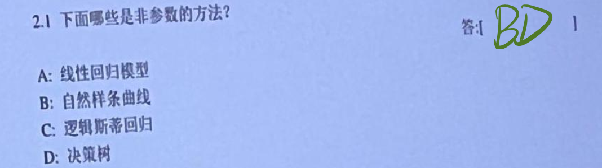
自然样条曲线并不假设数据符合某种特定的函数形式（如线性或多项式），而是通过分段多项式和节点（knots）来灵活拟合数据。这是非参数特性。
回归树不需要预先设定任何特定的模型形式，而是通过数据驱动的方式划分输入空间。
##### 非参数方法的共同特征
模型灵活：无需预设具体的函数形式，模型复杂度与数据量相关。
数据驱动：模型结构直接依赖于数据，增加数据量可以改善模型表现。
适用性广：能处理更广泛的数据分布和非线性关系。
##### 参数方法

假设函数f具有一定的形式，用训练数据集去拟合模型（估计参数），即把估计f的问题简化到估计一组参数

> 过拟合：拟合了错误或噪声

**[扩展与详解]**

*   **参数方法的步骤与类比**：
    1.  **假设形式**：先猜一个公式，比如 $f(X) = \beta_0 + \beta_1 X_1 + \beta_2 X_2$。这就像是买了一件**S/M/L码的成衣**，你假设自己的身材符合这些标准版型之一。
    2.  **拟合模型**：用数据去计算出最优的 $\beta_0, \beta_1, \beta_2$。这就像是在S/M/L码中挑选最合身的那一件。
    *   **优点**：简单、快速，需要的数据量少，结果容易解释（系数的意义明确）。
    *   **缺点**：如果最初的假设形式错了（比如真实关系是二次方），模型永远也无法拟合好，会导致高**偏差 (Bias)**。

##### 非参数方法

不对函数f的形式做明确的假设，追求尽可能接近数据点

（薄板样条）

**[扩展与详解]**

*   **非参数方法的步骤与类比**：
    1.  **不假设形式**：完全不预设公式。这就像是找一个**裁缝量身定制**衣服。
    2.  **拟合模型**：模型结构由数据点的位置和密度直接决定。数据点越多，模型就能描绘得越精细。
    *   **优点**：非常灵活，可以拟合任意复杂的函数形状，偏差低。
    *   **缺点**：需要大量数据才能获得稳定可靠的拟合；容易过度拟合数据中的噪声（高**方差 (Variance)**）；模型通常是一个复杂的黑箱，难以解释。
*   **薄板样条 (Thin-Plate Spline) 直观理解**：想象一块有弹性的薄金属板，数据点是钉子。把金属板压在这些钉子上，它自然弯曲形成的那个表面，就是薄板样条的拟合结果。它在保证通过数据点的同时，最小化了自身的“弯曲能量”，从而达到平滑的效果。

#### 预测精度和模型解释性的权衡

一般来说，当一种方法的光滑度增强时，其解释性减弱

**[扩展与详解]**
*   **光滑度 (Flexibility/Smoothness) 的双重含义**：在此处，“光滑度增强”指的是模型的**灵活性增强**（模型更复杂，曲线更弯曲）。这与数学上的平滑（二阶导数小）是反义的。
*   **权衡的具体体现**：
    *   **高解释性，低灵活性**：线性回归。模型非常简单，一个系数 $\beta_j$ 就清晰地解释了 $X_j$ 的影响。但它无法捕捉非线性关系。
    *   **中等解释性，中等灵活性**：广义可加模型 (GAMs)，决策树。GAMs 可以看出每个变量的非线性效应，树的规则也相对直观。
    *   **低解释性，高灵活性**：支持向量机 (带核函数)，Boosting，神经网络。这些模型能达到很高的预测精度，但内部机制极其复杂，很难说清楚某个变量具体是如何影响结果的。

####  指导学习和无指导学习

指导学习：数据集中有对应的响应变量来指导数据分析

> 逻辑斯蒂回归、支持向量机

无指导学习：数据集缺乏一个响应变量来指导数据分析

> 聚类分析

半指导学习：部分有，部分没有

**[扩展与详解]**
*   **核心区别**：是否有**正确答案** ($Y$)。
*   **指导学习 (Supervised Learning)**：像学生跟着老师做练习题。每道题 ($X$) 都有标准答案 ($Y$)。学习的目标是掌握从题目到答案的规律，以便将来能做没见过的新题。
*   **无指导学习 (Unsupervised Learning)**：像人类学家进入一个未知部落。没有“正确答案”，只能通过观察人们的行为、语言、穿着 ($X$)，自己去发现其中的社群结构、文化模式（例如，把人分为“猎人”、“祭司”、“农民”等簇）。
*   **半指导学习 (Semi-Supervised Learning)**：在拥有大量未标记数据和少量有标记数据时使用。例如，在照片库中，你手动标记了100张“猫”的照片，但还有10万张未标记。算法可以利用这100张标记过的照片来学习，并尝试将其学到的知识应用到10万张未标记的照片中，从中发现结构，反过来再优化模型。

####  回归与分类问题

变量常分为**定量**和**定性**两种类型。响应变量定量是回归问题，响应变量定性则是分类问题

**[扩展与详解]**
*   **定量 (Quantitative)**：数值是连续的或可以进行有意义的数学运算。例如：身高、体重、温度、价格。
*   **定性 (Qualitative / Categorical)**：数值代表类别或标签，不能直接进行数学运算。例如：性别（男/女）、血型（A/B/O/AB）、品牌（苹果/三星/华为）。
*   **问题判别**：
    *   预测明天的**气温**是多少度？ -> **回归**
    *   预测明天**是否会下雨**？ -> **分类** (二分类：下/不下)
    *   预测一个产品的**销量**？ -> **回归**
    *   预测一封邮件**是否是垃圾邮件**？ -> **分类**


###   评价模型精度

#### 拟合效果检验

常用的评价准则是**均方误差**（mean squared error, **MSE**）
$$
MSE = \frac{1}{n}\sum_{i=1}^{n}(y_i-\hat{f}(x_i))^2
$$
$$
MSE = \frac{1}{n}*RSS
$$
我们的目标是使模型的测试均方误差最低

当模型的光滑度增加时，训练均方误差降低，但是测试均方误差不一定降低

> 当模型有较小的训练均方误差，但是有较大的测试均方误差时，称为过拟合
>
> 降低模型的光滑度可以减小测试均方误差

**[扩展与详解]**
*   **训练MSE vs 测试MSE**：这是评估模型性能最核心的区别。
    *   **训练MSE**：在用于**构建模型**的数据集上计算的MSE。它衡量的是模型对“已知考题”的掌握程度。
    *   **测试MSE**：在模型**从未见过**的新数据集上计算的MSE。它衡量的是模型的**泛化能力**，即对“未来新考题”的预测能力。
    *   **我们的终极目标永远是最小化测试MSE**。训练MSE再低，如果测试MSE很高，这个模型也是失败的。
*   **过拟合的直观理解**：一个学生把练习册上的所有题都背了下来（训练MSE=0），但对知识点本身一知半解。到了考场上，题目稍微变个数字或问法（测试集），他就完全不会了（测试MSE巨大）。这就是过拟合。

##### 自由度

自由度是**描述曲线光滑程度**的正式术语

**[扩展与详解]**
*   **自由度 (Degrees of Freedom, df)** 在这里指的是模型的**有效复杂度**或**灵活性**。
    *   **线性回归**：自由度等于预测变量的个数 $p$。
    *   **样条回归**：自由度与结点的数量有关，结点越多，自由度越高，曲线越弯曲。
    *   **KNN**：自由度与 $K$ 成反比，约为 $n/K$。$K$ 越小，自由度越高，模型越灵活。
    *   **高自由度** = 低光滑度 = 复杂模型。
    *   **低自由度** = 高光滑度 = 简单模型。

#### 偏差-方差权衡

$$
E(y_0-\hat{f}(x_0))^2=Var(\hat{f}(x_0))+[Bias(\hat{f}(x_0))]^2+Var(ε)
$$

> 测试均方误差的期望能分解为：预测值$\hat{f}(x_0)$的方差、预测值$\hat{f}(x_0)$的偏差的平方、误差项ε的方差

因此我们需要得到一个偏差和方差综合起来最小的模型

##### 方差和偏差
| 特性               | **偏差**                                         | **方差**                                         |
|--------------------|-------------------------------------------------|-------------------------------------------------|
| **定义**           | 模型预测结果的平均值与真实值之间的偏离程度       | 模型预测值在不同训练集上的波动程度               |
| **本质**           | 由模型的假设能力决定，反映模型是否欠拟合         | 由模型对训练数据的敏感性决定，反映模型是否过拟合 |
| **光滑度的影响**   | 光滑度低，偏差高（欠拟合）；光滑度高，偏差低     | 光滑度低，方差低；光滑度高，方差高（过拟合）     |
| **训练集大小的影响**| 不直接受到训练集大小影响，偏差主要由模型决定     | 训练集增大通常可以降低方差                       |


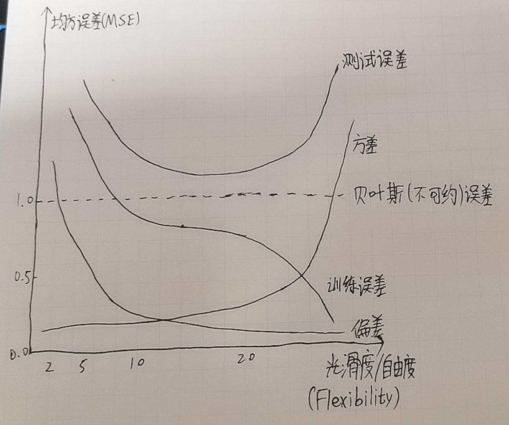

如果一个统计学习模型被称为测试性能好，则要求该模型有较小的方差和较小的偏差
**一般而言，使用光滑度更高的方法，所得的模型方差会增加，偏差会减小。**

**[扩展与详解]**

*   **打靶比喻**：
    *   **靶心**：真实值 $f(x_0)$。
    *   **每一次射击**：用一个训练集训练出的模型 $\hat{f}(x_0)$ 进行的一次预测。
    *   **偏差 (Bias)**：所有射击点的**平均位置**与靶心的距离。高偏差意味着你系统性地射偏了，比如瞄准镜歪了。这对应**欠拟合**。
    *   **方差 (Variance)**：所有射击点**散布的范围**。高方差意味着你的手很不稳，每次射击都偏离平均位置很远。这对应**过拟合**。
    *   **四种情况**：
        1.  **低偏差，低方差 (理想)**：射击又准又稳，都集中在靶心。
        2.  **高偏差，低方差 (欠拟合)**：射击很稳，但系统性地偏离靶心（比如都打在9点钟方向）。
        3.  **低偏差，高方差 (过拟合)**：射击平均位置在靶心，但散布范围很大，满靶都是弹孔。
        4.  **高偏差，高方差 (最差)**：射得又偏又散。
*   **模型复杂度与权衡**：
    *   **简单模型（如线性回归）**：假设强，瞄准镜可能是歪的（高偏差），但每次射击都很稳定（低方差）。
    *   **复杂模型（如K=1的KNN）**：假设弱，能瞄准靶心（低偏差），但手抖得厉害（高方差），因为模型会去拟合训练数据中的每一个噪声点。
    *   **权衡**：我们的目标不是追求极致的低偏差或低方差，而是找到一个平衡点，使得**总误差（偏差平方+方差）最小**。这通常是一个中等复杂度的模型。

#### 分类模型

训练错误率如下公式
$$
\frac{1}{n}\sum_{i=1}^{n}I(yi\neq \hat yi)
$$
测试错误率如下公式，
$$
Ave(I(y0 \neq \hat y0))
$$

贝叶斯分类器
KNN
k 的选择对获得 KNN 分类器有根本性的影响。当 K= 1 时，决策边界很不规则，从数据中拟合的模型不能与贝叶斯决策边界完全契合。这个分类器虽然偏差较低但方差很大。当 K 增加时，模型的光滑性减弱，得到一个接近线性的决策边界。
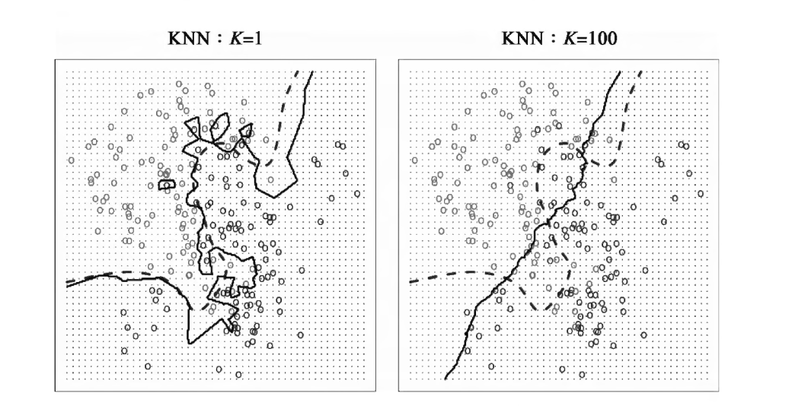

**[扩展与详解]**
*   **指示函数 $I(\cdot)$**：这是一个简单的计数工具。如果括号里的条件为真，函数值为1，否则为0。所以 $\sum I(y_i \neq \hat{y}_i)$ 就是简单地数出分类错误的样本个数。
*   **贝叶斯分类器 (Bayes Classifier)**：
    *   **定义**：这是一个理论上**最优**的分类器，它将每个观测分配给**后验概率最大**的那个类别。即，对于观测 $x_0$，如果 $P(Y=1|X=x_0) > 0.5$，就分为类别1，否则分为类别0。
    *   **贝叶斯错误率**：由贝叶斯分类器产生的错误率是所有分类器中最低的，它也构成了**不可约误差**。这个错误率之所以不为0，是因为在某些区域，不同类别的概率分布会重叠，导致即使是上帝视角的分类器也会犯错。
    *   **实用性**：在现实中，我们永远无法知道真实的条件概率分布 $P(Y|X)$，所以贝叶斯分类器无法直接实现，它只是一个供我们追赶的**理论基准 (Gold Standard)**。
*   **KNN 与贝叶斯分类器的关系**：KNN 算法实际上是在尝试用局部数据来**估计**贝叶斯分类器所需要的条件概率。当 $K$ 很大且样本量 $n$ 很大时，KNN 的决策边界会趋近于贝叶斯决策边界。
    *   **K值与偏差-方差**：
        *   **小 K (如 K=1)**：模型非常灵活，决策边界扭曲。**低偏差**（能捕捉局部细节），**高方差**（对单个数据点敏感）。
        *   **大 K**：模型更平滑，决策边界趋于线性。**高偏差**（忽略局部细节），**低方差**（结果更稳定）。

---

##  第三章 线性模型


线性回归是一种统计方法，用于研究两个或多个变量之间的线性关系。根据变量数量的不同，可以分为简单线性回归和多元线性回归。


###  简单线性回归

####  定义
简单线性回归用于研究两个变量之间的线性关系，其中一个是**自变量**（`X`），另一个是**因变量**（`Y`）。其数学模型表示为：
$$
Y = \beta_0 + \beta_1X + \epsilon
$$
- $\beta_0$：截距，表示当`X=0`时`Y`的预测值。
- $\beta_1$：斜率，表示`X`每增加一个单位时，`Y`的平均变化量。
- $\epsilon$：随机误差。

**[扩展与详解]**

*   **模型的核心思想**：简单线性回归试图找到一条直线，这条直线能最好地“穿过”数据点的中心趋势。
*   **系数的直观解释**：
    *   **$\beta_0$ (Intercept)**：截距。在现实意义上，需要注意 $X=0$ 是否在数据范围内且有意义。例如，在“体重-身高”回归中，$X$（身高）=0 是无意义的，此时 $\beta_0$ 只是一个数学上的起点，没有实际解释价值。但在“广告费-销售额”回归中，$X$（广告费）=0 是有意义的，此时 $\beta_0$ 代表“无广告投入时的基础销售额”。
    *   **$\beta_1$ (Slope)**：斜率。这是最重要的参数，它量化了 $X$ 和 $Y$ 之间的关系。
        *   $\beta_1 > 0$：$X$ 增加，$Y$ 也随之增加（正相关）。
        *   $\beta_1 < 0$：$X$ 增加，$Y$ 反而减少（负相关）。
        *   $\beta_1 = 0$：$X$ 和 $Y$ 之间没有线性关系。这是假设检验中我们通常想要“拒绝”的零假设。

####  目标
通过最小化 **残差平方和（RSS）** 来估计参数 $\beta_0$ 和 $\beta_1$：
$$
RSS = \sum_{i=1}^n (Y_i - (\beta_0 + \beta_1X_i))^2
$$

**[扩展与详解]**

*   **最小二乘法 (Least Squares)**：最小化 RSS 的方法被称为最小二乘法。这个名字非常形象：我们试图让残差 (residuals) 的平方和 (squares) 达到最小 (least)。
*   **为什么是平方？**
    1.  **消除符号**：残差有正有负，直接相加会相互抵消。
    2.  **惩罚大误差**：平方操作会不成比例地放大较大的误差。一个为 4 的误差平方后是 16，而两个为 2 的误差平方和是 $4+4=8$。这意味着模型会优先去拟合那些离群较远的点。
*   **解析解**：对于简单线性回归，$\beta_0$ 和 $\beta_1$ 的最优解（记为 $\hat{\beta}_0, \hat{\beta}_1$）可以通过微积分求导得到一个封闭的公式解，不需要迭代计算。

####  标准误差和置信区间
在线性回归模型中，回归系数 $\beta_1$ 的置信区间用于估计其真实值可能的范围，基于其估计值 $\hat{\beta}_1$ 和标准误差 $SE(\hat{\beta}_1)$。
$\beta_1$ 的标准误差公式如下：
$$
SE(\hat{\beta}_1) = \sqrt{\frac{\hat{\sigma}^2}{\sum_{i=1}^n (X_i - \bar{X})^2}}
$$
对于线性回归模型，$\beta_1$的置信区间如下：
$$
\hat \beta_1 \pm 2 *SE(\hat \beta_1)
$$

**[扩展与详解]**

*   **标准误差 $SE(\hat{\beta}_1)$ 的含义**：它衡量了 $\hat{\beta}_1$ 这个估计值的不确定性。如果我们换一组新的数据来重新拟合模型，得到的 $\hat{\beta}_1$ 会有所不同。$SE(\hat{\beta}_1)$ 就是这些不同 $\hat{\beta}_1$ 值的标准差的估计。标准误差越小，我们的估计就越精确。
*   **公式解读**：
    *   分子 $\hat{\sigma}^2$：这是残差的方差（即 RSE 的平方），代表了数据点偏离回归线的平均程度。数据点越分散，$\hat{\sigma}^2$ 越大，我们对系数的估计就越不确定。
    *   分母 $\sum(X_i - \bar{X})^2$：这衡量了 $X$ 值的散布范围。$X$ 值分布得越广，分母越大，标准误差就越小。直观上，数据点在横轴上拉得越开，我们对斜率的估计就越有信心。
*   **置信区间 (Confidence Interval)**：
    *   **95% 置信区间**：我们通常用 $\hat{\beta}_1 \pm 2 \times SE(\hat{\beta}_1)$ 来近似计算 95% 置信区间 (这里的 2 约等于正态分布的 1.96)。
    *   **解释**：“95% 置信”的正确解释是：如果我们反复从总体中抽样并构建 100 个这样的区间，大约有 95 个区间会包含真实的 $\beta_1$ 值。
    *   **应用**：最重要的应用是进行**假设检验**。如果 $\beta_1$ 的 95% 置信区间**不包含 0**，我们就可以在 5% 的显著性水平上拒绝“$\beta_1 = 0$”的零假设，从而得出结论：$X$ 和 $Y$ 之间存在显著的线性关系。

#### 假设
1. 自变量和因变量之间存在线性关系。
2. 残差的期望为零，即 $E(\epsilon) = 0$。
3. 残差方差恒定（同方差性）。
4. 残差独立。
5. 残差服从正态分布（通常用于推断）。

**[扩展与详解]**

*   这些假设也被称为**高斯-马尔可夫假设**，是最小二乘法估计具有良好性质（如无偏性和有效性）的前提。
    1.  **线性关系 (Linearity)**：如果关系是非线性的，模型就是错误的，预测会有系统性偏差。
    2.  **残差期望为零 (Zero Conditional Mean)**：这是最核心的假设之一，意味着模型的形式是正确的，没有遗漏系统性的信息。
    3.  **同方差性 (Homoscedasticity)**：残差的方差不随 $X$ 的变化而变化。如果违反（异方差），系数估计仍然是无偏的，但其标准误和置信区间是错误的，导致假设检验失效。
    4.  **独立性 (Independence)**：一个观测的残差不应与另一个观测的残差相关。常在时间序列数据中被违反（今天的误差可能和昨天有关），这会导致标准误被严重低估。
    5.  **正态性 (Normality)**：这个假设主要用于构建置信区间和进行假设检验。即使不满足，只要样本量足够大，根据中心极限定理，系数的抽样分布也会趋于正态。

---

###  多元线性回归

####  定义
多元线性回归扩展了简单线性回归，用于研究多个自变量（`X1, X2, ..., Xp`）与因变量`Y`之间的线性关系。其数学模型为：
$$
Y = \beta_0 + \beta_1X_1 + \beta_2X_2 + \cdots + \beta_pX_p + \epsilon
$$

- $\beta_0$：截距，表示所有自变量为0时`Y`的预测值。
- $\beta_1, \beta_2, \dots, \beta_p$：各自变量的回归系数，表示该自变量对因变量的影响（假设其他变量保持不变）。

**[扩展与详解]**

*   **核心变化**：从拟合一条线变为拟合一个**超平面 (hyperplane)**。
*   **系数解释的关键**：解释 $\beta_j$ 时，必须加上限定条件：“**在保持其他所有预测变量不变的情况下**”。这也被称为 ceteris paribus。
    *   **示例**：在模型 $Sales = \beta_0 + \beta_1 TV + \beta_2 Radio$ 中，$\beta_1$ 的含义是：在 Radio 广告预算**保持不变**时，TV 广告预算每增加一元，Sales 的平均变化量。如果不加这个限定，解释就是错误的，因为 TV 和 Radio 的投入可能本身就相关。

#### 目标
通过最小化残差平方和来估计参数：
$$
RSS = \sum_{i=1}^n \left( Y_i - \left( \beta_0 + \sum_{j=1}^p \beta_jX_{ij} \right) \right)^2
$$

**[扩展与详解]**

*   目标函数的形式与简单线性回归完全一致，只是预测值 $\hat{Y}_i$ 的计算方式变得更复杂。最小二乘法的原理依然适用。

####  假设
与简单线性回归相同，但需要针对多变量：
1. 自变量与因变量之间的关系是线性的。
2. 各个自变量之间无高度共线性。
3. 残差的期望为零，方差恒定，独立且服从正态分布。

**[扩展与详解]**

*   多元回归的假设基本继承自简单回归，但增加了一个关键的新假设：**无多重共线性 (No Multicollinearity)**。这是因为如果两个预测变量高度相关（如“身高”和“腿长”），模型就无法分辨出到底是哪个变量在真正影响 $Y$，导致系数估计的方差变得极大，结果极不稳定。

### 评估模型参数
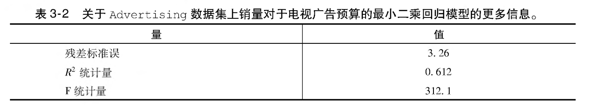
$$
RSE = \sqrt{\hat{\sigma}^2} = \sqrt{\frac{1}{n - p - 1} \sum_{i=1}^n (Y_i - \hat{Y}_i)^2}
$$
$$
R^2 = 1 - \frac{\sum_{i=1}^n (Y_i - \hat{Y}_i)^2}{\sum_{i=1}^n (Y_i - \bar{Y})^2} = 1-\frac{RSS}{TSS}
$$
$$
F = \frac{\frac{\text{Explained Variance}}{p}}{\frac{\text{Unexplained Variance}}{n - p - 1}} = \frac{\frac{TSS - RSS}{p}}{\frac{RSS}{n - p - 1}}
$$
RSE越小、$R^2$越大，F越小，结果越好。

**[扩展与详解]**

*   **RSE**：自由度变为 $n-p-1$（因为要估计 $p$ 个斜率和 1 个截距，共 $p+1$ 个参数）。
*   **$R^2$ (R-squared / 决定系数)**：
    *   **TSS (Total Sum of Squares)**: $\sum(Y_i - \bar{Y})^2$，是响应变量 $Y$ 自身的总变异。
    *   **含义**：$R^2$ 表示 $Y$ 的总变异中，**能被模型中所有 $X$ 变量解释的比例**。$R^2=0.7$ 意味着销售额波动的 70% 可以由广告投入的变化来解释。
    *   **局限性**：向模型中添加任何变量（即使是无关的随机数），$R^2$ 都只会增加或保持不变，永远不会减少。这使得它不适合用于比较含有不同数量变量的模型。为此，我们引入**调整 $R^2$ (Adjusted $R^2$)**，它对变量数量进行了惩罚。
*   **F 统计量 (F-statistic)**：
    *   **用途**：用于检验模型的**整体显著性**。
    *   **零假设 $H_0$**：$\beta_1 = \beta_2 = \dots = \beta_p = 0$ (所有变量都无效)。
    *   **备择假设 $H_1$**：至少有一个 $\beta_j \neq 0$ (至少有一个变量有效)。
    *   **解读**：F 值衡量的是模型解释的方差与未解释的方差之比。如果 F 值远大于 1（通常看其对应的 p-value 是否小于 0.05），我们就可以拒绝零假设，认为这个模型整体上是有意义的。
    *   **注意**：原文“F越小，结果越好”是**错误**的。**F 越大，结果越好**，因为它意味着模型解释的方差远大于随机误差。

###  回归模型的其他问题
####  数据的非线性
残差图( residual plot) 是一种很有用的图形工具，可用于识别非线性。给定一个简单线性回归模型，我们就可以绘制残差 $ ei = Yi - Yi $ 和预测变量 X i 的散点图。在多元回归中，因为有多个预测变量，我们转而绘制残差与预测值(或拟合值 ( fitted)) Yi 的散点图。**理想情况下，残差图显示不出明显的规律。若存在明显规律，则表示线性模型的某些方面可能有问题。**

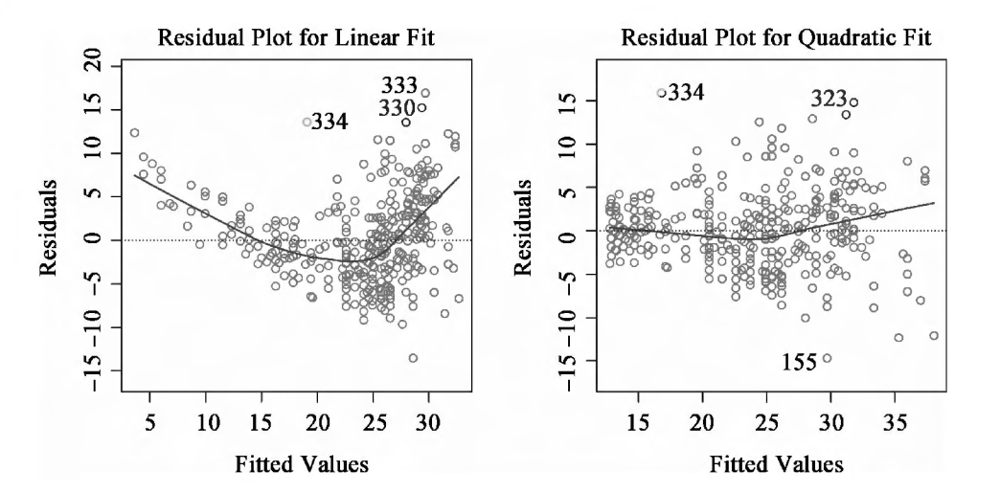

**[扩展与详解]**

*   **残差图的原理**：残差 $e_i = Y_i - \hat{Y}_i$ 是模型未能解释的信息。如果模型是正确的，这些残差应该像随机噪声一样，没有任何模式。
*   **模式解读**：
    *   **U型或倒U型**：如图所示，表明真实关系可能是二次的。解决方法是添加 $X^2$ 项到模型中（多项式回归）。
    *   **任何系统性曲线**：都表明线性假设不成立，需要对 $X$ 进行变换（如 $\log(X), \sqrt{X}$）或使用更复杂的非线性模型。

####   误差项自相关
线性回归模型的一个重要假设是误差项𝜀_1,𝜀_2,… 𝜀_𝑛不相关。如果误差项相关，那么估计标准误往往低估了真实标准误，因此，置信区间和预测区间比真实区间窄。例如95%置信区间包含真实参数的实际概率将远低于0.95。这可能导致得出错误的结论。

**[扩展与详解]**

*   **自相关 (Autocorrelation)**：也称序列相关，常见于按时间顺序收集的数据（时间序列）。例如，今天股票市场的冲击可能会影响到明天的市场情绪，导致误差项相关。
*   **后果**：系数估计 $\hat{\beta}$ 仍然是无偏的，但其标准误 $SE(\hat{\beta})$ 的计算是错误的（通常会严重偏小）。这会导致 t 统计量虚高，p 值虚低，使得我们错误地认为某些不显著的变量是显著的。
*   **检测**：绘制残差与时间的图，观察是否有模式。或者使用 Durbin-Watson 检验。

####   误差项方差非恒定
线性回归模型的另一个重要假设是误差项的方差是恒定的$ VAR(𝜀_𝑖)=𝜎^2$。假设检验和标准误差、置信区间计算依赖这一假设。
但通常，误差项的方差不是恒定的。例如，误差项的方差可能会随响应值的增加而增加。如果残差图呈漏斗形，说明误差项方差非恒定或存在异方差性。
下左图，残差随拟合值增加而增加。
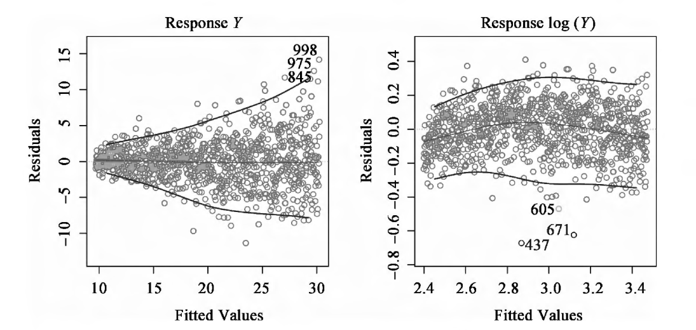

**[扩展与详解]**

*   **异方差性 (Heteroscedasticity)**：如图所示的“漏斗形”是典型特征。这意味着对于较大的预测值，预测的不确定性也更大。
    *   **例子**：预测个人收入。对于低收入人群，预测误差可能在几百元内。但对于高收入人群（如CEO），预测误差可能在几十万元。
*   **后果**：与自相关类似，系数估计无偏，但标准误和置信区间错误，假设检验不可靠。
*   **修正**：
    1.  **对数变换**：对响应变量 $Y$ 取对数 $\log(Y)$，可以有效压缩较大值的范围，缓解异方差。
    2.  **加权最小二乘 (Weighted Least Squares)**：给方差较小的观测（信息量更可靠）赋予更高的权重。

####  离群点
离群点(outlier) 是指 Yi 远离模型预测值的点。
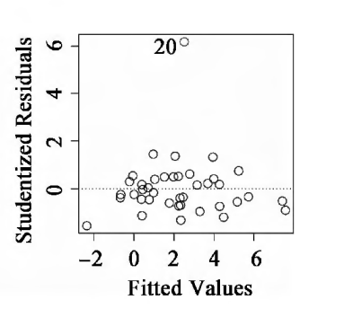

**[扩展与详解]**

*   **定义**：离群点是 $Y$ 值异常的点，其残差非常大。
*   **检测**：可以通过学生化残差 (Studentized residuals) 来识别，如果其绝对值大于 3，通常被认为是离群点。
*   **影响**：离群点会显著增大 RSE，降低 $R^2$ 和模型的拟合优度。它们可能代表数据录入错误，也可能是真实但罕见的事件。处理方式需要视情况而定，不能轻易删除。

####  高杠杆点
高杠杆(high leverage)表示观测点Xi是异常的。

**[扩展与详解]**

*   **定义**：高杠杆点是 $X$ 值异常的点，即它在预测变量空间中处于极端位置。
*   **杠杆值 (Leverage Statistic)**：每个观测点都有一个杠杆值，取值在 $1/n$ 到 1 之间，所有点的平均杠杆值为 $(p+1)/n$。如果一个点的杠杆值远大于平均值，它就是高杠杆点。
*   **影响**：高杠杆点**有潜力**对回归线产生巨大影响，因为它像一个杠杆的支点。如果这个点的 $Y$ 值也恰好偏离趋势，它就会成为一个**强影响点 (Influential Point)**，极大地改变回归系数。

####   R语言 Residuals vs Leverage 图
横轴（Leverage）：表示杠杆值，衡量每个样本对模型拟合的影响。高杠杆点靠近图的右侧。
纵轴（Residuals）：表示标准化残差，衡量实际值与预测值的差异。
Cook’s Distance：用虚线表示，用于综合评估点对模型的影响力。

##### 离群点：
通常出现在图的**上部或下部**，残差值明显大于其他点（高出或低于 2 或 3 的范围）。
这些点虽然对模型的影响力可能不大，但反映了模型在预测这些点时的误差较大。
##### 高杠杆点：
横轴位置靠右，杠杆值较高。这些点的 Cook’s Distance 较大，可能显著影响模型参数。
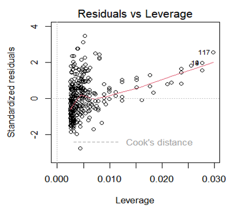
117是高杠杆点，纵坐标大于2的是离群点。

**[扩展与详解]**

*   这张图是回归诊断的利器，它将残差和杠杆值结合在一起，让我们能同时识别离群点、高杠杆点和强影响点。
*   **Cook's Distance**：它综合了残差和杠杆值，直接衡量删除某个点后，所有拟合值的变化有多大。Cook's Distance 的等高线在图中通常以虚线表示。如果一个点越过了 Cook's Distance 的虚线（通常是 0.5 或 1），它就被认为是**强影响点**，需要特别关注。
*   **图中四个象限**：
    1.  **左下角**：低杠杆，小残差（好点）。
    2.  **左上/左下角（远离横轴）**：低杠杆，大残差（普通离群点）。
    3.  **右下角（靠近横轴）**：高杠杆，小残差（“好的”高杠杆点，它虽然极端，但符合整体趋势，反而能帮助稳定回归线）。
    4.  **右上/右下角（远离横轴）**：高杠杆，大残差（**强影响点**，最危险的点）。

#### 共线性
共线性是指两个或更多的预测变量高度相关。如下图Credit数据集（右图），它会导致难以分离单个变量对响应值的影响。
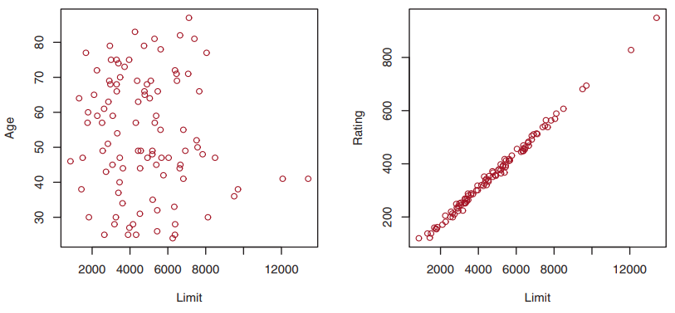
检测共线性的一个简单方法是看预测变量的相关系数矩阵。但即使没有某对变量具有特别高的相关性，有可能三个或更多变量之间存在共线性，成为多重共线性。
更好的方法是计算方差膨胀引子（VIF），VIF是拟合全模型时的系数(𝛽_𝑗 ) ̂的方差除以单变量回归中(𝛽_𝑗 ) ̂的方差所得的比例。VIF最小可能值是1，表示完全不存在共线性。通常情况，VIF值超过5或10就表示有共线性问题。

**[扩展与详解]**

*   **共线性的后果**：
    1.  **系数估计不稳定**：模型无法确定功劳应该归给哪个相关的变量，导致系数的标准误变得非常大。
    2.  **系数解释困难**：系数的符号甚至可能与预期相反。
    3.  **假设检验不可靠**：t 检验可能显示所有变量都不显著，而 F 检验却显示模型整体显著。
*   **VIF 的计算逻辑**：对于变量 $X_j$，我们先用其他所有变量来预测它，得到一个 $R^2_j$。这个 $R^2_j$ 衡量了 $X_j$ 能被其他变量解释的程度。$VIF_j = 1 / (1 - R^2_j)$。如果 $R^2_j$ 接近 1（说明 $X_j$ 几乎是其他变量的线性组合），分母就接近 0，VIF 趋于无穷大。
*   **处理方法**：
    1.  **移除变量**：从一组相关的变量中移除一个或多个。
    2.  **合并变量**：将相关的变量合并成一个新变量（如用 PCA）。
    3.  **使用正则化**：岭回归对共线性问题特别有效。

####  线性回归与K最近邻法的比较 维度灾难。
预测效果随着维数的增加而恶化是KNN一个普遍问题，因为在高维中样本量大大减少。下图有100个训练观察，当p=1时，这些点提供了足够的信息来准确估计f(X)。然而，当这100个观测值分布在p=20个维度上时，将使给定的观测附近没有邻点——即	若每个预测变量仅有少量观测，参数化方法往往优于非参数方法。
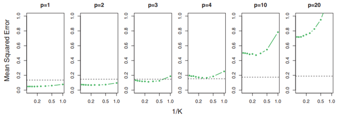

**[扩展与详解]**

*   **维度灾难 (Curse of Dimensionality)**：随着维度 $p$ 的增加，为了保持邻域内样本点的密度不变，所需的总样本量 $n$ 必须呈指数级增长。
*   **KNN 的脆弱性**：KNN 是一个纯粹的局部方法，它的预测完全依赖于“近邻”的定义。在高维空间中：
    1.  **数据稀疏**：所有的数据点都变成了“离群点”，彼此之间都很远。
    2.  **“近邻”不再近**：最近的邻居可能也相距甚远，不再具有代表性。
*   **线性回归的优势**：线性回归是一个参数化方法，它做出了一个非常强的假设（线性关系）。这个强假设（高偏差）使得它对数据的局部密度不那么敏感。在高维、小样本的情况下，这种牺牲灵活性换取稳定性的策略（低方差）往往能获得更好的预测效果。这是偏差-方差权衡在高维场景下的一个经典体现。


##  第四章 分類

### 邏輯斯蒂回归
#### 概述
邏輯斯蒂回归是一種廣泛使用的線性分類模型，用於預測二分類或多分類問題的結果。其核心思想是通過 **邏輯函数 (logistic function)** 將線性回归的預測值映射到 [0, 1] 区間，從而得到分類概率。
#### 數學表達
$$
\log\left(\frac{P}{1-P}\right) = z
$$
其中：
- \( P \) 是事件發生的概率。
- \( 1-P \) 是事件不發生的概率。
- \( z = w^T x + b \)，表示線性模型的輸出。

**[扩展与详解]**

*   **為什麼需要邏輯斯蒂回歸？**
    *   直接使用線性回歸做分類有兩個主要問題：1) 預測值可能超出 [0, 1] 範圍，無法解釋為概率。2) 對於分類問題，誤差分佈不再是正態的，違背了線性回歸的基本假設。
*   **從概率到對數發生比的推導**：
    1.  **概率 (Probability, P)**：我們想預測的目標，取值範圍 $[0, 1]$。
    2.  **發生比 (Odds)**：$Odds = \frac{P}{1-P}$。它表示事件發生的概率與不發生的概率之比。例如，如果 $P=0.8$，則 Odds=4，意為發生的可能性是不發生的4倍。Odds 的取值範圍是 $[0, \infty)$。
    3.  **對數發生比 (Log-odds or Logit)**：$\log(Odds) = \log(\frac{P}{1-P})$。取對數後，取值範圍變為 $(-\infty, +\infty)$。
*   **核心思想**：我們成功地將一個取值範圍受限的概率 $P$ 轉換成了一個取值範圍不受限的 Log-odds。這樣，我們就可以假設這個 Log-odds 與預測變量 $X$ 之間存在**線性關係**：
    $$ \log\left(\frac{P}{1-P}\right) = \beta_0 + \beta_1X_1 + \dots + \beta_pX_p $$
    這就是邏輯斯蒂回歸模型的本質。它是一個在對數發生比尺度上的線性模型。
*   **從 Log-odds 反推概率**：
    *   為了得到概率，我們需要進行逆運算。從上式可得 $P(X) = \frac{e^{\beta_0 + \beta_1X_1 + \dots}}{1 + e^{\beta_0 + \beta_1X_1 + \dots}}$。這個函數就是**邏輯函數 (Logistic Function)** 或 **Sigmoid 函數**，它的輸出值總是在 (0, 1) 之間，完美地解釋為概率。

### 線性判別分析
####  概述
線性判別分析是由費舍爾提出的一種經典的降維與分類方法，常用于將高維數據投影到低維空間，同時保持類别的可分性。LDA的核心思想是通過最大化類間散布與類内散布的比值，以找到數據最優的分割方向。
#### 核心思想
LDA的目標是找到一個線性變換矩陣 \( W \)，使得投影後的數據在類間的距離最大化，同時類内的距離最小化。
LDA的目的是將高維特徵投影到一個低維子空間中同時保持類間的良好可分性和類内的最大化方差。
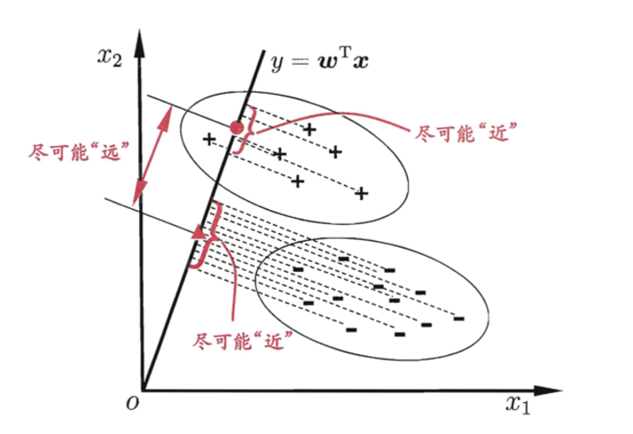

**[扩展与详解]**

*   **LDA 的兩種視角**：
    1.  **降維視角 (Fisher)**：如圖所示，找到一個投影方向，使得投影後不同類別的數據點分得最開。具體來說，是最大化「投影後類別中心的距離平方」與「投影後類內方差之和」的比值。
    2.  **分類視角 (Bayes)**：LDA 是一種基於**貝葉斯定理**的分類器。它假設每個類別 $k$ 的數據都服從一個多元高斯（正態）分佈，並且**所有類別共享同一個協方差矩陣 $\Sigma$**。
        *   貝葉斯公式：$P(Y=k|X=x) = \frac{\pi_k f_k(x)}{\sum_{l=1}^K \pi_l f_l(x)}$
        *   其中 $\pi_k$ 是第 $k$ 類的先驗概率，$f_k(x)$ 是第 $k$ 類的高斯概率密度函數。
        *   通過一系列數學推導，可以證明決策邊界（即 $P(Y=k|X=x)$ 相等的點）是一個**線性**方程，這就是“線性”判別分析的由來。

#### ROC曲線
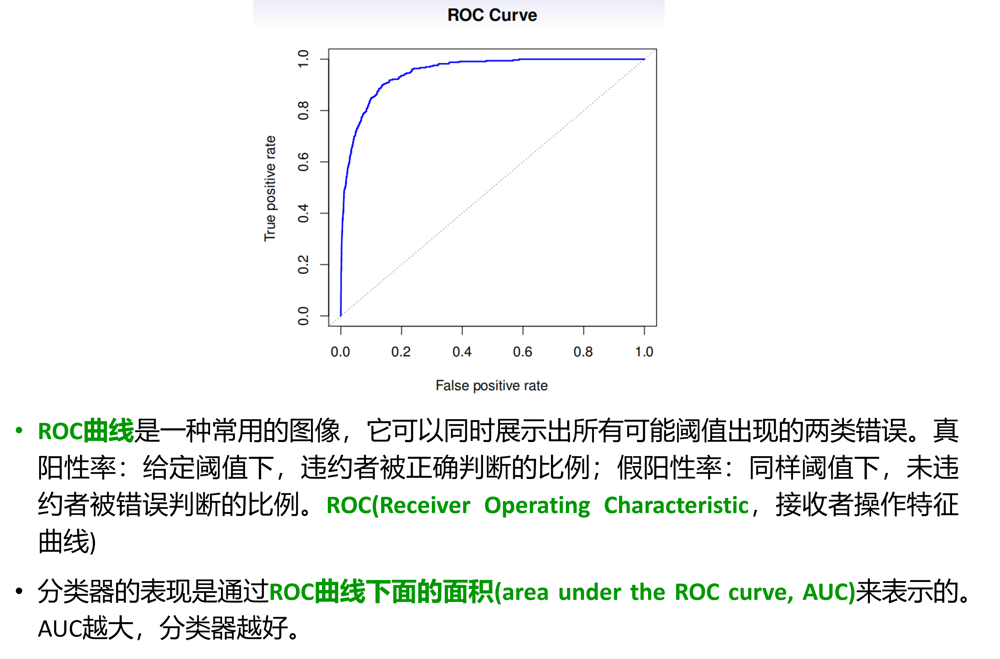
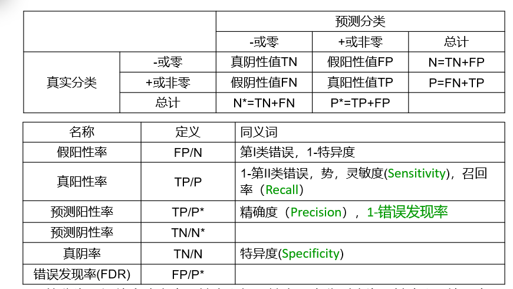
1. 預測陽性率 (PPV)
預測陽性率指的是，模型預測為陽性的樣本中，實際為陽性的比例。它衡量的是模型預測結果的可靠性，即模型預測為“陽性”時有多大可能是真的陽性。

2. 預測陰性率 (NPV)
預測陰性率指的是，模型預測為陰性的樣本中，實際為陰性的比例。它衡量的是模型預測結果為“陰性”時的可靠性。.

3. 假陽性率是預測為陽性，但真實是陰性.
4. 假陰性率是預測為陰性，真實是陽性。

**[扩展与详解]**

*   **混淆矩陣 (Confusion Matrix)**：所有這些指標都來源於一個 2x2 的表格，它是分類模型評估的基礎。

| | **真實: 陽性 (1)** | **真實: 陰性 (0)** |
| :--- | :--- | :--- |
| **預測: 陽性 (1)** | 真陽性 (TP) | 假陽性 (FP) |
| **預測: 陰性 (0)** | 假陰性 (FN) | 真陰性 (TN) |

*   **重要指標的公式化定義**：
    *   **預測陽性率 (PPV) / 精確率 (Precision)**: $\frac{TP}{TP+FP}$ (預測為陽性的裡面，有多少是真的)
    *   **預測陰性率 (NPV)**: $\frac{TN}{TN+FN}$ (預測為陰性的裡面，有多少是真的)
    *   **假陽性率 (FPR)**: $\frac{FP}{FP+TN}$ (真實為陰性的裡面，有多少被誤報了)。**這是 ROC 曲線的橫軸**。
    *   **假陰性率 (FNR)**: $\frac{FN}{TP+FN}$ (真實為陽性的裡面，有多少被漏報了)。
    *   **真陽性率 (TPR) / 敏感度 (Sensitivity) / 召回率 (Recall)**: $\frac{TP}{TP+FN}$ (真實為陽性的裡面，有多少被成功找到了)。**這是 ROC 曲線的縱軸**。
    *   **真陰性率 (TNR) / 特異度 (Specificity)**: $\frac{TN}{FP+TN} = 1 - FPR$。
*   **ROC 曲線的繪製與解讀**：
    *   分類器（如邏輯斯蒂回歸）輸出的是一個概率值。通過移動分類閾值（從 1 到 0），我們可以得到一系列的 (FPR, TPR) 點對，將這些點連起來就是 ROC 曲線。
    *   **AUC (Area Under Curve)**：ROC 曲線下的面積。AUC = 0.5 代表隨機猜測，AUC = 1 代表完美分類。AUC 是一個衡量模型在**所有可能閾值下**整體性能的指標。

### 二次判別分析
如果假設服從多元高斯分佈，但每一類觀測都有自己的協方差矩陣，則稱作二次判別分析(quadratic discriminant analysis, QDA)
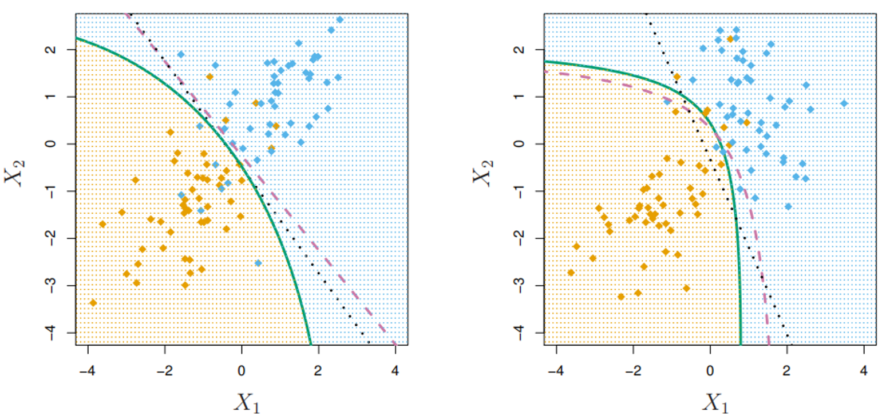
貝葉斯（紫色虛錢）、LDA（黑色點錢）、QDA（綠色實錢）

**[扩展与详解]**

*   **QDA 與 LDA 的唯一區別**：QDA 放寬了 LDA 的“所有類別共享同一個協方差矩陣”的假設，允許每個類別 $k$ 擁有自己獨特的協方差矩陣 $\Sigma_k$。
*   **後果**：
    *   **決策邊界**：因為協方差矩陣不同，在推導貝葉斯決策邊界時，二次項無法消去，最終得到的決策邊界是一個關於 $X$ 的**二次函數**。這意味著 QDA 的決策邊界是曲線（如拋物線、雙曲線、圓形），比 LDA 的直線更靈活。
    *   **偏差-方差權衡**：
        *   **QDA**：更靈活，**偏差較低**（能擬合更複雜的真實邊界）。但需要估計更多的參數（每個類別一套協方差矩陣），因此**方差較高**，需要更多的訓練數據，且更容易過擬合。
        *   **LDA**：模型更簡單，限制性更強，**偏差較高**，但**方差較低**。

### 方法比較
邏輯斯諦回歸中參數是由極大似然估計出來的
LDA是通過估計的正態分佈均值和方差計算出來的
所以兩者得到的結果應該是接近的。但LDA假設觀測服從每一類協方都相同的高斯分佈，當假設成立時，LDA能提供更好的結果

> 將一個數據集分成大小相同的訓練集和測試集，嘗試兩種不同的分類過程。首先應用邏輯斯諦回歸，在訓練集上得到錯誤率為 20%.在測試集上錯誤率為 30% 。其次應用 1 最近鄰法 (K=1) ， 得到平均錯誤率{在訓練集和測試袋上始平均)為 18%。基於這些結果，對新的觀測應採取何種分類方法比較好?為什麼?
> 	應用K=1的KNN經過訓練集訓練後，計算訓練数据集上的準確度，我們會得到100%的準確率，原因是模型已經看到了這些值，並且為K=1形成了一個粗略的決策邊界。這意味著本題K=1的KNN在訓練集上的錯誤率為0%，而在測試集上的錯誤率為36%。而邏輯斯蒂回歸在測試集上的錯誤率為30%，比36%低一些，故選擇邏輯斯蒂回歸分類方法。

**[扩展与详解]**

*   **LDA vs. 邏輯斯蒂回歸**：
    *   **相似性**：兩者都產生線性的決策邊界。
    *   **差異**：
        *   **模型類型**：LDA 是**生成模型 (Generative Model)**，它對每個類別的數據分佈 $P(X|Y)$ 進行建模（假設為高斯分佈），然後使用貝葉斯定理得到 $P(Y|X)$。邏輯斯蒂回歸是**判別模型 (Discriminative Model)**，它直接對 $P(Y|X)$ 進行建模，不關心 $X$ 的分佈。
        *   **性能**：如果數據確實來自協方差相等的高斯分佈，LDA 的參數估計更穩定，效率更高（偏差更小）。如果這個假設不成立，邏輯斯蒂回歸因為假設更少，通常表現得更穩健。
*   **思考題的深度解析**：
    *   **核心原則**：評估模型好壞的**唯一標準**是它在**未知數據（測試集）**上的表現。
    *   **分析 KNN (K=1)**：
        *   訓練錯誤率：對於任何一個訓練點，離它最近的點就是它自己，所以 K=1 的 KNN 在訓練集上的錯誤率理論上是 **0%** (除非存在兩個特徵完全相同但標籤不同的點)。
        *   題目中的“平均錯誤率18%”可能是指訓練集和測試集的平均。如果訓練錯誤率為0%，那麼測試錯誤率就是 36%。
        *   高方差：K=1 的模型極度擬合訓練數據的噪聲，方差極大，泛化能力很差。
    *   **分析邏輯斯蒂回歸**：
        *   測試錯誤率為 30%。
    *   **結論**：應選擇**邏輯斯蒂回歸**。因為它的測試錯誤率 (30%) 明顯低於 K=1 KNN 的測試錯誤率 (36%)。模型的訓練表現好壞並不重要，重要的是它在新數據上的預測能力。

## 第五章 重抽樣方法

引入的目的：為了估計測試誤差

基本方法：將可用的樣本隨機分為**訓練集**和**測試集**

定量的響應應使用均方誤差估計，定性的響應應使用誤分類率評估

**[扩展与详解]**

*   **重抽樣的根本動機**：在理想世界中，我們可以通過收集大量新的測試數據來直接評估模型的測試誤差。但在現實中，數據是有限且寶貴的。重抽樣方法是一系列聰明的統計技巧，它通過對**現有訓練數據**進行反複的、有策略的抽樣，來**模擬**獲得新數據集的過程，從而得到對測試誤差的可靠估計。

### 交叉驗證法

#### 驗證集方法

直接隨機將數據集分為訓練集和測試集兩部分

##### 優點

- 計算簡便
- 可解釋性較好

##### 缺點

- 測試錯誤率的驗證法的估計波動大，取決於具體哪些觀測包含在訓練集/驗證集中
- 只有一個子集被用來擬合模型，驗證集的錯誤率可能會高估在整個數據集上擬合模型的測試誤差

**[扩展与详解]**

*   **高方差的來源**：想像一下，如果你的數據集中有幾個特別“奇怪”的離群點。如果隨機劃分時，這些點恰好都分到了驗證集，那麼測出來的錯誤率可能會異常高。如果它們都分到了訓練集，測出來的錯誤率可能又會異常低。驗證集方法的結果對這一次隨機劃分**過於敏感**。
*   **高偏差的來源**：通常我們會用 50% 或 70% 的數據做訓練。這意味著我們的模型是在一個比完整數據集小很多的數據集上訓練的。數據量越小，模型學習到的信息就越少，性能通常越差。因此，用這種“縮水”模型在驗證集上得到的錯誤率，會系統性地**高於**用全部數據訓練出的模型在未來真實測試集上的錯誤率。

#### 留一交叉驗證（LOOCV）

選一個觀測作為測試集，剩下n-1個觀測作為訓練集，訓練並測試，得到這個觀測的均方誤差MSE

重複這個步驟n次，得到n個MSE，然後使用如下公式計算平均的MSE
$$
CV_{(n)}=\frac{1}{n}\sum_{i=1}^{n}MSE_i
$$

**[扩展与详解]**

*   **算法流程**：
    1.  從 $n$ 個樣本中，取出第 1 個樣本作為驗證集，用剩下的 $n-1$ 個樣本訓練模型，然後預測第 1 個樣本，計算其誤差 $MSE_1$。
    2.  取出第 2 個樣本作為驗證集，用剩下的 $n-1$ 個樣本訓練模型，預測第 2 個樣本，計算其誤差 $MSE_2$。
    3.  ... 重複 $n$ 次。
    4.  最終的 LOOCV 誤差是所有 $n$ 個誤差的平均值。
*   **優點**：
    *   **低偏差**：每次都用 $n-1$ 個樣本訓練，這個數量非常接近完整數據集的大小 $n$。因此，得到的測試誤差估計非常接近“用全部數據訓練的模型的真實測試誤差”。
    *   **無隨機性**：無論你做多少次 LOOCV，結果都是一樣的，因為劃分方式是固定的。
*   **缺點**：
    *   **計算成本高**：需要訓練 $n$ 個模型。如果 $n$ 很大且模型複雜，這將是無法接受的。
    *   **高方差**：雖然它的偏差低，但其誤差估計的方差可能很高。因為 $n$ 個訓練集之間高度重疊（都共享 $n-2$ 個樣本），導致 $n$ 次的誤差估計值彼此高度相關。這意味著如果原始數據集中有幾個強影響點，它們會影響幾乎所有的 $n$ 次訓練，使得最終的平均誤差估計可能不穩定。

#### K折交叉驗證

將觀測機隨機分為k個大小基本一致的組，每次選一個組作為測試集，剩下k-1個組作為訓練集，訓練並測試，得到這個測試集的均方誤差MSE

重複這個步驟k次，得到n個MSE，然後同樣進行平均計算

##### 優點

- 相較LOOCV，方差更低
- 相較LOOCV，計算更簡便

##### 缺點

- 相較LOOCV，偏差更高
- 相較LOOCV，存在分割的隨機性，LOOCV不存在這個問題

**[扩展与详解]**

*   **算法流程 (以 K=5 為例)**：
    1.  將數據隨機打亂，平均分成 5 份 (fold 1, ..., fold 5)。
    2.  **第1輪**：用 fold 2,3,4,5 作為訓練集，fold 1 作為測試集，計算 $MSE_1$。
    3.  **第2輪**：用 fold 1,3,4,5 作為訓練集，fold 2 作為測試集，計算 $MSE_2$。
    4.  ... 重複 5 次。
    5.  最終的 K-折 CV 誤差是 $MSE_1, ..., MSE_5$ 的平均值。
*   **K折是完美的折衷**：
    *   **計算成本**：只需訓練 K 個模型（通常 K=5 或 10），遠少於 LOOCV 的 n。
    *   **偏差**：每次用 $(K-1)/K$ 的數據訓練（如 80% 或 90%），訓練集大小仍然很接近全集，所以偏差比驗證集方法低，只比 LOOCV 略高。
    *   **方差**：不同折的訓練集之間重疊較少（例如 5 折中，任意兩輪訓練集只重疊 3/4），使得 K 次的誤差估計相關性較低，平均後的結果更穩定，方差比 LOOCV 低。

##### K折交叉驗證的偏差-方差權衡

K減小，偏差減小方差增大；K增大，方差減小偏差增大

**[扩展与详解]**
*   **注意**：原文這裡的描述存在**筆誤和混淆**。讓我們重新梳理：
    *   **當 K 增大 (從 2 向 n 變化)**：
        *   訓練集的大小 $(K-1)/K \times n$ 隨之增大，越來越接近 $n$。
        *   因此，模型是在更大的數據集上訓練的，其性能更接近於用全部數據訓練出的模型。
        *   這意味著測試誤差估計的**偏差會減小**。
        *   同時，不同折之間的訓練集重疊度增加，模型間相關性變高，可能導致最終誤差估計的**方差會增大**。
    *   **正確的關係**：
        *   **K 增大** $\implies$ **偏差減小，方差增大** (趨向於 LOOCV)。
        *   **K 減小** $\implies$ **偏差增大，方差減小**。

### 自助法

用途：用來衡量一個指定的估計量，比如估計線性回歸模型中係數的標準誤差

隨機從數據集中選擇n個觀測（有放回的抽樣），組成一個自助法數據集$Z^{·1}$，使用這個數據集對α進行自助法估計，得到$\hat{α}^{·1}$

重複B次（B是一個很大的值），得到B個對應的估計$\hat{α}^{·1},...,\hat{α}^{·B}$，然後通過公式能計算這些自助法估計的標準誤差
$$
SE_B(\hat{α})=\sqrt{\frac{1}{B-1}\sum_{r=1}^{B}(\hat{α}^{·r}-\frac{1}{B}\sum_{r^{'}=1}^{B}\hat{α}^{·r^{'}})^2}
$$

**[扩展与详解]**

*   **自助法 (Bootstrap) 的核心思想**：它通過模擬從“我們擁有的樣本所代表的總體”中重複抽樣的過程，來估計一個統計量的不確定性。
*   **“有放回抽樣”的意義**：這是關鍵。從大小為 $n$ 的原始樣本中，有放回地抽取 $n$ 次，得到一個新的“自助樣本”。在這個新樣本中，有些原始觀測可能出現多次，有些可能一次都沒出現。這個過程模擬了從一個無限總體中重新獲取一個大小為 $n$ 的新樣本的過程。
*   **算法流程（以估計中位數的標準誤為例）**：
    1.  我們有一個原始樣本，大小為 $n$。
    2.  從原始樣本中**有放回地**抽取 $n$ 個觀測，組成第一個自助樣本 $S_1$。
    3.  計算 $S_1$ 的中位數 $M_1$。
    4.  重複步驟 2 和 3 共 B 次（如 B=1000），得到 B 個中位數估計值：$M_1, M_2, ..., M_B$。
    5.  這 B 個值構成了一個中位數的經驗分佈。計算這 B 個值的標準差，就是對真實中位數標準誤的估計。

#### 自助法的其他用途

- 主要用於得到估計的標準誤差
- 還提供了總體參數的近似置信區間

**[扩展与详解]**
*   **構建置信區間**：得到 B 個自助法估計值後，最簡單的構建 95% 置信區間的方法是**百分位法 (Percentile Method)**。將這 B 個值從​​小到大排序，取第 2.5 百分位和第 97.5 百分位的值，就構成了一個 95% 的置信區間。

#### 自助法不能估計測試誤差的原因

- k折交叉驗證中，每一折中的k-1訓練集和驗證集都不重疊
- 使用自助法估計測試誤差，假如使用每個抽樣的樣本作為訓練樣本，原始樣本作為驗證樣本，發現每個抽樣樣本和原始樣本有顯著的重疊（約三分之二），導致其嚴重低估真實的測試誤差

**[扩展与详解]**
*   **重疊率的數學解釋**：對於一個大小為 $n$ 的樣本，在一次有放回的抽樣中，某個特定觀測**不被選中**的概率是 $(1 - 1/n)$。在 $n$ 次抽樣中，它**始終不被選中**的概率是 $(1 - 1/n)^n$。當 $n$ 很大時，這個值約等於 $e^{-1} \approx 0.368$。
*   **結論**：每個自助樣本平均只包含約 $1 - 0.368 = 63.2\%$ 的獨立原始觀測。這意味著訓練集（自助樣本）和驗證集（原始樣本）之間有高達 63.2% 的重疊。用幾乎相同的數據進行訓練和測試，得到的誤差自然會嚴重偏低。
*   **袋外 (Out-of-Bag) 估計**：雖然 Bootstrap 不能直接估計測試誤差，但它提供了一種間接的方式。對於每個原始觀測，我們可以找到所有那些**不包含**它的自助樣本（約佔 1/3），讓在這些樣本上訓練出的模型來預測它。這個過程稱為 OOB 估計，是對測試誤差的有效無偏估計，常用於隨機森林。

### 方法比較
| 特性                | 自助法                         | 交叉驗證                      | 驗證集法                  |
|---------------------|-------------------------------|-------------------------------|---------------------------|
| **數據利用率**     | 每次生成的樣本約63.2%數據被訓練用，多次重採樣覆蓋全部數據。 | 每次僅用部分數據作為測試集，其余數據用於訓練。 | 留出一部分數據做驗證集，浪費部分數據。 |
| **評估可靠性**     | 稍遜，因生成的樣本可能失真。     | 更可靠，因所有數據都參與訓練和測試。 | 結果可能因劃分隨機性不穩定。 |
| **計算成本**       | 低，每次只需生成樣本并訓練一個模型。 | 高，需要多次訓練模型并測試。   | 較低，只需訓練一個模型并測試一次。 |
| **適用場景**       | 數據量較小時，尤其適合。         | 需要更可靠評估時適用，尤其是數據量較小。 | 數據量較大時快速評估。     |
| **是否浪費數據**   | 否，所有數據多次被利用。         | 否，所有數據都被用到。         | 是，驗證集不參與訓練。     |


**[扩展与详解]**

*   **表格內容辨析與補充**：
    *   **自助法數據利用率**：這裡的描述有些模糊。準確地說，在估計**標準誤**時，每次都利用了一個大小為 n 的自助樣本。在估計**測試誤差**時（OOB），每個模型也是在約 63.2% 的數據上訓練。
    *   **自助法計算成本**：這裡的“低”是相對的。原文“只需生成樣本並訓練一個模型”是**錯誤**的。自助法需要訓練 B 個模型（B 通常是 1000 或更多），其計算成本通常**遠高於** K 折交叉驗證。
    *   **自助法適用場景**：它的主要優勢不在於評估測試誤差，而在於當一個統計量的標準誤難以用數學公式求解時（如中位數、分位數），自助法提供了一種強大的、通用的計算方法。
*   **總結**：
    *   **模型選擇/測試誤差估計**：首選 **K 折交叉驗證**。
    *   **估計參數的標準誤/置信區間**：首選 **自助法**。
    *   **數據量極大，且計算成本敏感**：可以考慮**驗證集法**作為快速粗略的評估。


## 第六章 線性模型選擇與正則化

採用其他擬合方法替代最小二乘法的原因：其他方法有**更高的預測準確率**，**更好的模型解釋力**

**預測準確率**

- 不滿足n遠大於p，則最小二乘可能過擬合
- 若p>n，最小二乘得到的係數估計結果不唯一，此时方差無窮大，無法使用最小二乘

<u>改進：通過**限制**或**縮減**待估計係數，犧牲偏差的同時顯著減小估計量方差</u>

**模型解釋力**

- 多元回歸模型中，常存在多個變量與響應變量不存在線性關係的情況，增加複雜度卻與模型無關
- 去除不相關特徵可以得到更容易解釋的模型，而最小二乘很難將係數置為0

<u>改進：通過自動進行**特徵選擇**或**變量選擇**，實現對無關變量的篩選</u>


**[扩展与详解]**
*   **核心動機**：標準的最小二乘法 (OLS) 雖然在理想條件下（$n \gg p$，無共線性等）是最佳線性無偏估計，但在現實世界中往往表現不佳。本章介紹的方法都是為了解決 OLS 的這些缺陷。
*   **預測準確率 vs. 偏差-方差權衡**：OLS 是一個低偏差、高方差的估計。當 $p$ 接近 $n$ 或存在共線性時，其方差會急劇增大，導致過擬合。本章的壓縮估計方法（嶺回歸、Lasso）通過向模型中引入少量偏差（限制係數大小），來換取方差的大幅降低，從而提高整體預測準確率。
*   **模型解釋力 vs. 稀疏性**：OLS 會給所有變量都分配一個非零係數，即使某些變量完全是噪聲。這使得模型難以解釋。一個包含 3 個重要變量的模型遠比一個包含 100 個變量的模型更容易理解和應用。本章的子集選擇和 Lasso 方法旨在產生**稀疏模型 (Sparse Model)**，即大部分係數為 0 的模型，從而提高解釋力。

### 子集選擇

#### 最優子集選擇

對於k=1,2,...,p: 擬合$C_p^k$個包含k個預測變量的模型，並且在這$C_p^k$個模型中選擇RSS最小或$R^2$最大的模型

然後根據交叉驗證預測誤差、$C^p(AIC)$、$BIC$或調整$R^2$從這些模型中選一個最優模型

- 缺陷明顯：p比較大時不具有計算可行性

**[扩展与详解]**
*   **兩步過程**：
    1.  **篩選**：對於每個固定的變量個數 $k$，找出包含 $k$ 個變量的模型中，RSS 最小的那一個。這一步會產生 $p+1$ 個候選模型（包括空模型）。
    2.  **決選**：在這 $p+1$ 個候選模型中，使用交叉驗證或 AIC/BIC 等指標，選出最終的唯一最優模型。**不能直接用 RSS 或 $R^2$ 在這 $p+1$ 個模型之間比較**，因為它們總是偏愛變量更多的模型。
*   **計算災難**：需要擬合的模型總數是 $\sum_{k=0}^p C_p^k = 2^p$。當 $p=20$ 時，這就是一百萬個模型；$p=40$ 時，這個數字比宇宙中的原子還多。因此，該方法僅適用於 $p$ 很小的情況。

#### 逐步選擇

逐步選擇包括**向前逐步選擇**和**向後逐步選擇**

##### 向前逐步選擇

對於k=1,2,...,p: 從p-k個模型中選擇（在前一個模型基礎上增加一個變量），並且在這p-k個模型中選擇RSS最小或$R^2$最大的模型

然後根據交叉驗證預測誤差、$C^p(AIC)$、$BIC$或調整$R^2$從這些模型中選一個最優模型

##### 後向逐步選擇

對於k=p,p-1,...,1: 從k個模型中選擇（在前一個模型基礎上減少一個變量），並且在這p-k個模型中選擇RSS最小或$R^2$最大的模型

然後根據交叉驗證預測誤差、$C^p(AIC)$、$BIC$或調整$R^2$從這些模型中選一個最優模型

**[扩展与详解]**
*   **貪心算法 (Greedy Algorithm)**：逐步選擇是一種貪心算法。它在每一步都做出局部最優的選擇（增加或刪除對 RSS 改善最大的變量），而不考慮全局的最優解。
*   **計算效率**：
    *   向前選擇：需要擬合的模型總數是 $1 + p + (p-1) + \dots + 1 \approx p^2/2$。
    *   向後選擇：與向前選擇類似，計算量級也是 $O(p^2)$。
    *   這遠小於最優子集選擇的 $O(2^p)$，使其適用於高維數據。
*   **局限性**：因為是貪心算法，它**不能保證找到全局最優模型**。例如，可能最好的雙變量模型 ($X_1, X_2$) 並不包含最好的單變量模型 ($X_3$)。向前選擇法會錯過這種情況。
*   **適用場景**：
    *   向前選擇：適用於 $p > n$ 的情況，因為它從空模型開始，逐步增加變量。
    *   向後選擇：要求 $n > p$，因為它需要從擬合完整模型開始。

#### 選擇最優模型的指標

$C_p$、$AIC$、$BIC$和調整$R^2$
$$
C_p=\frac{1}{n}(RSS+2d\hat{σ}^2)
$$

$$
AIC=\frac{1}{n\hat{σ}^2}(RSS+2d\hat{σ}^2)
$$

$$
BIC=\frac{1}{n}(RSS+log(n)d\hat{σ}^2)
$$

$$
調整R^2=1-\frac{RSS/(n-d-1)}{TSS/(n-1)}
$$

**[扩展与详解]**
*   **核心思想**：這些指標都是在**訓練誤差 (RSS)** 的基礎上，增加一個對**模型複雜度 (變量個數 $d$)** 的懲罰項。模型越複雜，懲罰越大。我們的目標是選擇使這些指標值最小（或調整 $R^2$ 最大）的模型。
*   **指標對比**：
    *   **$C_p$ 和 AIC**：這兩個指標在本質上是等價的（AIC 是 $C_p$ 的一個比例縮放）。它們對模型複雜度的懲罰項是 $2d$。
    *   **BIC (Bayesian Information Criterion)**：它的懲罰項是 $\log(n)d$。
    *   **BIC vs. AIC**：當 $n > 7$ 時，$\log(n) > 2$。這意味著對於中等到大型的數據集，BIC 對模型複雜度的**懲罰力度遠大於 AIC**。因此，BIC 傾向於選擇比 AIC **更簡單（變量更少）**的模型。
    *   **調整 $R^2$**：它的邏輯是將 RSS 和 TSS 都除以各自的自由度。增加無效變量會使 RSS 的減小不足以抵消分母自由度的減小，從而導致調整 $R^2$ 下降。

### 壓縮估計方法

####  嶺回歸（L2正則化）

與最小二乘相似，但增加了壓縮懲罰
$$
\sum_{i=1}^{n}(y_i-β_0-\sum_{j=1}^{p}β_jx_{ij})^2+λ\sum_{j=1}^{p}β_j^2=RSS+λ\sum_{j=1}^{p}β_j^2
$$
λ≥0是調節參數，λ越小光滑度越高，偏差越小方差越大

※ 使用嶺回歸之前最好先對預測變量進行標準化

**[扩展与详解]**
*   **調節參數 $\lambda$ 的作用**：
    *   $\lambda$ 控制了懲罰項的強度，是偏差-方差權衡的調節器。
    *   當 $\lambda = 0$ 時，懲罰項消失，嶺回歸退化為普通的最小二乘法。
    *   當 $\lambda \to \infty$ 時，為了最小化目標函數，所有係數 $\beta_j$ 必須趨近於 0。
    *   $\lambda$ 的最優值需要通過交叉驗證來確定。
*   **為什麼要標準化？**
    *   嶺回歸的懲罰項 $\sum \beta_j^2$ 對所有係數一視同仁。但係數的數值大小受變量自身單位（量綱）的影響。例如，變量“工資”（單位：元）的係數會遠小於“工資”（單位：萬元）的係數。如果不進行標準化，嶺回歸會不成比例地壓縮那些僅僅因為單位問題而數值較大的係數。標準化（使所有變量均值為0，標準差為1）可以消除這種不公平。

#### Lasso（L1正則化）

$$
\sum_{i=1}^{n}(y_i-β_0-\sum_{j=1}^{p}β_jx_{ij})^2+λ\sum_{j=1}^{p}|β_j|=RSS+λ\sum_{j=1}^{p}|β_j|
$$

λ≥0是調節參數，λ越小光滑度越高，偏差越小方差越大

**[扩展与详解]**
*   **Lasso 與嶺回歸的核心區別**：Lasso 使用 L1 範數 ($\sum |\beta_j|$) 作為懲罰項，而嶺回歸使用 L2 範數的平方 ($\sum \beta_j^2$) 作為懲罰項。
*   **L1 懲罰的特性**：L1 懲罰有一個特殊的性質，即當 $\lambda$ 足夠大時，它能夠將某些係數**精確地壓縮到 0**。這使得 Lasso 成為一種嵌入式的**特徵選擇**方法。
*   **稀疏性 (Sparsity)**：Lasso 產生的模型是稀疏的（大部分係數為0），這極大地提高了模型的可解釋性。

#### 嶺回歸和Lasso的等價問題

Lasso回歸等價於求解
$$
\mathop{minimize}\limits_{β}\{\sum_{i=1}^{n}(y_i-β_0-\sum_{j=1}^{p}β_ix_{ij})^2\},\sum_{j=1}^{p}|β_j|≤s
$$
嶺回歸等價於求解
$$
\mathop{minimize}\limits_{β}\{\sum_{i=1}^{n}(y_i-β_0-\sum_{j=1}^{p}β_ix_{ij})^2\},\sum_{j=1}^{p}β_j^2≤s
$$


將上式數形結合表示如圖，黑色區域為≤s的區域，橢圓是RSS等高線

**[扩展与详解]**
*   **幾何解釋**：這是理解 Lasso 為何能產生稀疏解的關鍵。
    *   **RSS 等高線**：圖中的橢圓代表了 RSS 的等高線，中心點是最小二乘解 $\hat{\beta}^{OLS}$。我們的目標是找到離中心點最近（即 RSS 最小）的同時，又滿足約束條件的點。
    *   **約束區域**：
        *   嶺回歸的約束 $\sum \beta_j^2 \le s$ 是一個**圓形**區域（在高維是球體）。這個區域沒有尖角。
        *   Lasso 的約束 $\sum |\beta_j| \le s$ 是一個**菱形**區域（在高維是多面體）。這個區域有尖銳的角點，這些角點正好位於坐標軸上。
    *   **相切點**：RSS 的橢圓等高線從中心點開始擴張，它與約束區域的**第一個接觸點**就是最優解。
        *   對於嶺回歸的圓形區域，接觸點幾乎不可能正好在坐標軸上。
        *   對於 Lasso 的菱形區域，由於其尖角的存在，接觸點**很大概率**會發生在某個角點上。而角點就意味著某個係數 $\beta_j = 0$。這就是 Lasso 實現特徵選擇的幾何原理。

#### 嶺回歸和Lasso的貝葉斯解釋

嶺回歸對應高斯分佈的密度函數

Lasso對應拉普拉斯分佈的密度函數

**[扩展与详解]**
*   **貝葉斯視角**：正則化可以被看作是在對模型參數施加一個**先驗分佈 (Prior Distribution)**。
    *   **嶺回歸**：等價於假設係數 $\beta_j$ 的先驗分佈是一個均值為 0 的**高斯分佈**。高斯分佈是鐘形的，在 0 附近比較平滑，它認為係數應該比較小，但不太可能恰好為 0。
    *   **Lasso**：等價於假設係數 $\beta_j$ 的先驗分佈是一個均值為 0 的**拉普拉斯分佈**。拉普拉斯分佈在 0 處有一個尖峰，這意味著它有更高的先驗概率相信係數**恰好為 0**。

### 降維方法

#### 主成分回歸（PCA）

見第十章

**[扩展与详解]**
*   **主成分回歸 (Principal Components Regression, PCR)** 是一個兩步過程：
    1.  **降維**：對預測變量矩陣 $X$ 進行主成分分析 (PCA)，提取前 M 個方差最大的主成分 $Z_1, Z_2, \dots, Z_M$。這些主成分是原始變量的線性組合。
    2.  **回歸**：使用這 M 個主成分作為新的預測變量，對 $Y$ 進行普通的最小二乘回歸：$Y = \theta_0 + \theta_1 Z_1 + \dots + \theta_M Z_M + \epsilon$。
*   **優點**：可以處理共線性問題（因為主成分是正交的），並且可以應用於 $p>n$ 的情況。
*   **缺點**：主成分的選擇是**無監督**的，它只關心 $X$ 的方差，不考慮 $Y$。這可能導致選出的主成分與 $Y$ 的相關性不強，從而影響預測性能。

#### 偏最小二乘（PLS）

偏最小二乘用響應變量Y的信息篩選新變量

**[扩展与详解]**
*   **偏最小二乘 (Partial Least Squares, PLS)** 是一種有監督的降維方法。
*   **與 PCR 的核心區別**：PCR 在選擇方向（主成分）時只看 $X$ 的方差；而 PLS 在選擇方向時，會尋找那些**既能很好地解釋 $X$ 的方差，又能很好地解釋 $Y$ 的方差**的方向。
*   **結果**：由於 PLS 在降維過程中利用了 $Y$ 的信息，它找到的成分通常比 PCR 的成分更具有預測能力。在實踐中，PLS 的預測性能通常優於或等於 PCR。

#### PCA 和 PLS 區別
| **屬性**            | **PCA（主成分分析）**                     | **PLS（偏最小二乘法）**               |
|---------------------|------------------------------------------|---------------------------------------|
| **學習類型**        | 無監督學習                               | 監督學習                              |
| **輸入數據**        | 僅 \( X \)                               | \( X \) 和 \( Y \)                   |
| **目標**            | 最大化 \( X \) 的方差                    | 同時解釋 \( X \) 的方差和 \( X \)-\( Y \) 的關係 |
| **投影方向**        | 基於 \( X \) 的協方差矩陣                | 基於 \( X \) 和 \( Y \) 的協方差矩陣 |
| **應用場景**        | 數據降維、壓縮、去噪                     | 回歸、預測、多變量分析               |
| **輸出結果**        | 與 \( Y \) 無關的降維特徵                | 與 \( Y \) 強相關的降維特徵          |

### 高維數據的回歸問題

擬合並不光滑的最小二乘模型在高維中作用很大：

- 正則或壓縮在高維問題中至關重要
- 合適的調節參數對於得到好的預測非常關鍵
- 測試誤差會隨著數據維度的增加而增大，除非新增特徵變量與響應變量確實相關

**[扩展与详解]**
*   **高維的挑戰 ($p \gg n$)**：
    1.  **過擬合**：數據點在高維空間中變得極其稀疏（維度災難），模型很容易找到一個能完美穿過所有訓練點的超平面，導致訓練誤差為0，但泛化能力極差。
    2.  **噪聲累積**：大量的預測變量中不可避免地包含許多與響應無關的噪聲變量。傳統方法會給這些噪聲變量分配非零權重，從而累積誤差。
*   **應對策略**：
    1.  **正則化 (Regularization)**：如 Lasso 和嶺回歸，通過懲罰係數的大小來防止模型過度擬合噪聲。Lasso 在高維稀疏場景下尤其有效。
    2.  **降維 (Dimension Reduction)**：如 PCR 和 PLS，通過將高維特徵壓縮到低維空間來減少模型複雜度和噪聲。
    3.  **逐步選擇 (Stepwise Selection)**：如向前逐步選擇，通過貪心算法從大量變量中挑選出一個小的有效子集。
*   **核心思想**：在高維場景下，我們必須對模型施加某種**結構性約束**（如稀疏性、低維性），否則無法得到有意義的結果。


## 第七章 非線性模型

### 多項式回歸

$$
y=β_0+β_1x_i+β_2x_i^2+β_3x_i^3+...+β_dx_i^d+ε_i
$$

**[扩展与详解]**
*   **本質**：多項式回歸是通過創建預測變量 $X$ 的高次項（$X^2, X^3, \dots$），並將這些高次項作為**新的預測變量**納入一個**線性模型**中。因此，儘管它能擬合非線性關係，但其本質上仍然是一個可以用最小二乘法求解的多元線性回歸問題。
*   **優點**：實現簡單，能擬合多種曲線關係。
*   **缺點**：
    1.  **全局性**：擬合是全局的，數據集一端的變化會影響到整個曲線的形狀。
    2.  **不穩定性**：高階多項式（d 很大時）在數據的邊界區域會變得極其不穩定和擺動劇烈，這種現象稱為**龍格現象 (Runge's phenomenon)**。
    3.  **階數選擇困難**：階數 $d$ 是一個需要謹慎選擇的超參數，通常需要通過交叉驗證來確定。

### 階梯函數

創建分割點$c_1,c_2,...,c_K$，然後構造K+1個新變量：$C_0(X)=I(X<c_1),...,C_K(X)=I(c_k≤X)$
$$
y_i=β_0+β_1C_1(x_i)+β_2C_2(x_i)+...+β_KC_K(x_i)+ε_i
$$

**[扩展与详解]**
*   **本質**：階梯函數將一個連續的預測變量轉換為一個有序的分類變量，然後對這個分類變量進行回歸。模型擬合的是一個**分段常數**函數。
*   **優點**：實現簡單，模型結果非常容易解釋（例如，20-30歲年齡段的平均收入是多少）。
*   **缺點**：
    1.  **信息損失**：忽略了每個區間內變量的連續變化信息。
    2.  **邊界不連續**：在分割點（也稱“結”，knot）處，函數值會發生跳變，這在很多現實場景中是不合理的。
    3.  **分割點選擇**：分割點的數量和位置對模型影響巨大，需要預先確定。

### 基函數

多項式和階梯函數回歸模型實際上是特殊的基函數方法，對變量X的函數变换$b_1(X),b_2(X),...,b_K(X)$進行建模
$$
y_i=β_0+β_1b_1(x_i)+β_2b_2(x_i)+...+β_Kb_K(x_i)+ε_i
$$

**[扩展与详解]**
*   **通用框架**：基函數方法是一個非常通用的框架。其核心思想是，我們不直接用 $X$ 來擬合 $Y$，而是先對 $X$ 進行一系列的**非線性變換**（即基函數 $b_j(X)$），生成一組新的預測變量，然後用這些新變量來對 $Y$ 進行標準的線性回歸。
*   **例子**：
    *   如果 $b_1(X)=X, b_2(X)=X^2, \dots, b_d(X)=X^d$，這就是**多項式回歸**。
    *   如果 $b_j(X) = I(c_j \le X < c_{j+1})$，這就是**階梯函數**。
    *   其他常用的基函數還包括傅里葉基（用於擬合週期性數據）和樣條基。

### 回歸樣條

不同區域擬合不同的多項式函數，可以這樣表示


沒有約束的有K個結點的三次樣條會產生4K+4個自由度

有K個結點的三次樣條會產生K+4個自由度（原因是每個結點處增加了三個約束：連續、一階導連續、二階導連續）

同時也可以使用樣條基函數表示
$$
y_i=β_0+β_1b_1(x_i)+β_2b_2(x_i)+...+β_{K+3}b_{K+3}(x_i)+ε_i
$$

**[扩展与详解]**
*   **核心思想**：回歸樣條 (Regression Splines) 結合了多項式回歸和階梯函數的優點。它在不同的數據區域擬合**分段多項式**（通常是三次多項式），並在分割點（結，knots）處增加**平滑性約束**。
*   **自由度計算詳解**：
    *   假設有 K 個結，將數據分為 K+1 個區域。
    *   在每個區域內擬合一個三次多項式（包含 $\beta_0, \beta_1, \beta_2, \beta_3$ 四個係數）。
    *   如果沒有任何約束，總共需要 $(K+1) \times 4$ 個參數。
    *   在每個結點處，我們施加三個約束：
        1.  **連續性**：左右兩邊的曲線必須在結點處相遇。
        2.  **一階導數連續**：左右兩邊曲線在結點處的斜率必須相等。
        3.  **二階導數連續**：左右兩邊曲線在結點處的曲率必須相等。
    *   總約束數量 = $K \times 3$。
    *   最終自由度（即需要估計的參數個數） = $4(K+1) - 3K = 4K + 4 - 3K = K + 4$。

#### 截斷冪基

在上述基函數式子中，可以選擇不同的基函數得到等價的三次樣條，比如截斷冪基的方式是先以三次多項式的基為基礎（$x,x_2,x_3$），然後在每個結點添加一個截斷冪基函數


其中ξ是結點

**[扩展与详解]**
*   **作用**：截斷冪基是實現帶約束的回歸樣條的一種巧妙的數學工具。它將複雜的約束問題轉化為一個簡單的基函數擴展問題。
*   **函數定義**：截斷冪函數 $h(x, \xi) = (x-\xi)_+^3$ 的定義是：如果 $x > \xi$，函數值為 $(x-\xi)^3$；如果 $x \le \xi$，函數值為 0。
*   **模型構成**：一個有 K 個結點 $\xi_1, \dots, \xi_K$ 的三次樣條模型可以表示為：
    $$ y_i = \beta_0 + \beta_1 x_i + \beta_2 x_i^2 + \beta_3 x_i^3 + \beta_4 h(x_i, \xi_1) + \dots + \beta_{K+3} h(x_i, \xi_K) + \epsilon_i $$
    這個模型自動滿足了所有結點處的連續性和導數連續性約束，且其自由度恰好是 $K+4$。

#### 確定結點的個數和位置

使用交叉驗證確定：首先移除10%的數據，用剩餘的數據擬合，然後對那部分被移除的數據進行預測（10折交叉驗證），最後計算整體的交叉驗證RSS。整個過程對不同的結點數K不斷嘗試

回歸樣條通常結果比多項式回歸好且穩定，回歸樣條通過固定自由度但是多設立結點的方式來獲得穩定的估計結果

**[扩展与详解]**
*   **結點位置 vs. 結點數量**：實踐證明，樣條擬合的性能對結點的**位置**不是特別敏感，但對結點的**數量**（即自由度）非常敏感。
*   **策略**：通常的做法是將結點均勻地放置在數據的分位數上（例如，放置在 25%、50%、75% 的位置）。然後，我們將重點放在通過交叉驗證來選擇最優的**結點數量 K**（或者說，選擇最優的自由度）。
*   **自然樣條 (Natural Spline)**：一種常用的改進是使用自然樣條，它在邊界區域（第一個結點之前和最後一個結點之後）強制函數為線性。這可以減少邊界處的不穩定性，降低方差。

### 光滑樣條

如果對$g(x_i)$不添加任何約束條件，只能得到一個取值為0的RSS，這樣的函數對數據嚴重過擬合。而實際上真正需要的g是滿足RSS尽量小，同時曲線盡量平滑（較少的突變，光滑度下降）

可以通過最小化下式
$$
\sum_{i=1}^{n}(y_i-g(x_i))^2+λ\int g''(t)^2dt
$$
λ由0增至∞，實際自由度$df_{λ}$從n降至2

**[扩展与详解]**
*   **與回歸樣條的根本區別**：
    *   **回歸樣條**是一種“參數化的非參數”方法。它通過選擇**少量**結點來控制光滑度，本質上是基函數回歸。
    *   **光滑樣條 (Smoothing Spline)** 是一種真正的非參數方法。它在**每一個**數據點 $x_i$ 上都隱含地放置了一個結點，然後通過一個**連續的懲罰項**來控制光滑度。
*   **懲罰項解釋**：
    *   $\int g''(t)^2dt$ 衡量了函數 $g(t)$ 的**總曲率**。二階導數 $g''(t)$ 代表曲線的彎曲程度，這個積分值越大，曲線整體就越“崎嶇”。
    *   **調節參數 $\lambda$** 在擬合優度 (RSS) 和光滑度之間進行權衡：
        *   $\lambda = 0$：沒有懲罰，模型會穿過每一個數據點，導致嚴重過擬合（自由度為 n）。
        *   $\lambda \to \infty$：對任何彎曲都施加無窮大的懲罰，迫使模型變成一條直線（最小二乘解，自由度為 2）。
*   **有效自由度 $df_\lambda$**：對於每個 $\lambda$ 值，都對應一個“有效自由度”，它衡量了光滑樣條的靈活性。$\lambda$ 的最優值可以通過交叉驗證來確定。

### 局部回歸

选取s=k/n比例的最靠近$x_0$的數據$x_i$

對選出的數據赋予其權重$K_{i0}=K(x_i,x_0)$，離$x_0$最遠的點權重為0，而最近的点權重最高

用定義好的權重在$x_i$處擬合加權最小二乘回歸

根據$\hat{f}(x_0)=\hat{β}_0+\hat{β}_1x_0$得到$x_0$的擬合結果

**[扩展与详解]**
*   **算法核心思想**：局部回歸 (Local Regression, LOESS) 是一種內存密集型的非參數方法。它的基本假設是，在任何一個點 $x_0$ 的小鄰域內，函數 $f(x)$ 可以被一個簡單的多項式（通常是線性或二次）很好地近似。
*   **算法步驟詳解 (以預測點 $x_0$ 為例)**：
    1.  **收集鄰域數據**：確定一個跨度 (span) $s$，選取離 $x_0$ 最近的 $s \times n$ 個數據點。
    2.  **分配權重**：為這個鄰域內的每一個點 $x_i$ 分配一個權重。權重函數（如三次權重函數）使得離 $x_0$ 越近的點權重越大，鄰域邊緣的點權重趨近於0。
    3.  **擬合局部加權回歸**：在這個鄰域內，擬合一個**加權**最小二乘回歸模型。例如，擬合 $Y = \beta_0 + \beta_1 X$。
    4.  **得到預測值**：將 $x_0$ 代入局部擬合出的模型，得到預測值 $\hat{f}(x_0) = \hat{\beta}_0 + \hat{\beta}_1 x_0$。
*   **注意**：要得到整個擬合曲線，需要對每一個需要預測的點都重複上述完整過程。

### 廣義可加模型

每一個變量用一個非線性函數替換
$$
y_i=β_0+f_1(x_{i1})+f_2(x_{i2})+...+f_p(x_{ip})+ε_i
$$

#### GAM的優點與不足

- 允許每一個$X_i$都擬合一個非線性$f_i$，非線性擬合模型能預測得更精准，且模型可加，能保持其他變量不變情況下觀測單變量對Y的影響效果

- 局限在於形式被限定為可加形式

**[扩展与详解]**
*   **GAM 的本質**：廣義可加模型 (Generalized Additive Models, GAMs) 是多元線性回歸的一個非線性擴展。它將標準線性模型中的每一項 $\beta_j x_j$ 替換為一個非線性的平滑函數 $f_j(x_j)$。
*   **函數 $f_j$ 的擬合**：每個函數 $f_j$ 都可以用任何非線性方法來擬合，最常用的是樣條（如光滑樣條）。
*   **優點詳解**：
    *   **靈活性**：GAMs 能自動地為每個變量找到最優的非線性變換，從而捕捉複雜的關係，提高預測精度。
    *   **可解釋性**：儘管模型是非線性的，但由於其**可加結構**，我們仍然可以像在線性模型中一樣，獨立地分析每個變量對響應的影響。我們可以繪製出每個 $f_j$ vs. $x_j$ 的圖，直觀地看出該變量是如何影響 $Y$ 的（例如，是U型關係還是S型關係）。這在解釋性上遠優於 SVM 或隨機森林等“黑箱”模型。
*   **不足詳解**：
    *   **可加性假設**：GAM 的核心局限在於它假設變量之間的影響是**可加的**，即忽略了變量之間的**交互作用 (interaction)**。例如，它無法捕捉到“藥物A的療效僅在年輕人中顯著”這種情況。如果存在強的交互作用，GAM 的表現可能會受限。

#### 用於分類的GAM

用邏輯斯蒂回歸的對數發生比即可
$$
log(\frac{p(X)}{1-p(X)})=β_0+f_1(X_1)+f_2(X_2)+...+f_p(X_p)
$$

$$
p(X)=Pr(y>n|f_1(X),f_2(X),f_3(X)...)
$$

**[扩展与详解]**
*   **廣義 (Generalized) 的含義**：GAM 中的“廣義”指的是它可以像廣義線性模型 (GLM) 一樣，處理非正態分佈的響應變量。
*   **分類應用**：對於二分類問題，響應變量服從伯努利分佈。我們可以對其**對數發生比 (logit)** 進行可加建模，這就得到了用於分類的 GAM。
*   **模型解釋**：擬合後，我們同樣可以繪製出每個 $f_j$ vs. $x_j$ 的圖，但此時縱軸的含義是該變量對**對數發生比**的貢獻。


## 第八章 基於樹的方法

### 決策樹基本概念

#### 回歸樹

建立回歸樹的步驟：

1.將預測變量空間（X1...Xp可能取值的集合）分為J個互不重疊的區域R1...Rj

2.對落入Rj的每個觀測值作同樣的預測，預測值等於Rj上訓練集響應值的算術平均，如果是分類樹，則分類為該區域最多的那類

計算決策樹模型的RSS：
$$
\sum_{j=1}^{J}\sum_{i∈Rj}(y_i-\hat{y}_{R_j})^2
$$
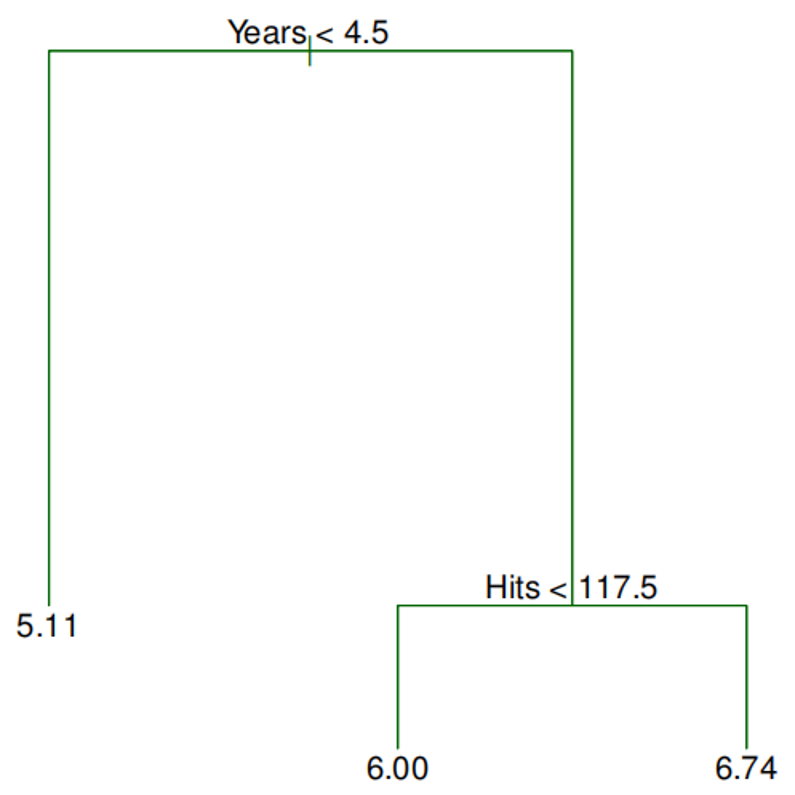

**[扩展与详解]**
*   **核心思想：遞歸二分 (Recursive Binary Splitting)**
    *   這是一種自頂向下的貪心算法。
    *   **步驟**：
        1.  從包含所有數據的根節點開始。
        2.  遍歷所有預測變量 $X_j$ 和其所有可能的切分點 $s$。
        3.  找到那個能使分裂後的兩個子節點的總 RSS **最小**的變量 $X_j$ 和切分點 $s$。
        4.  按照這個最優規則進行分裂，產生兩個新的節點。
        5.  對每個新節點，重複步驟 2-4，直到滿足停止條件（如節點內樣本數過少）。
*   **預測方式**：對於一個新的觀測，讓它從根節點開始，根據其特徵值沿著樹的路徑向下走，直到到達一個葉節點（終端區域 $R_j$）。該葉節點內所有訓練樣本的**平均值** $\hat{y}_{R_j}$ 就是對這個新觀測的預測值。

#### 分類樹

分類樹與回歸樹類似，但是評判标注不能使用RSS，改為分類錯誤率、基尼係數和互熵

分類錯誤率（classification error rate）
$$
E=1-\mathop{max}\limits_{p}(\hat{p}_{mk})
$$
基尼係數（Gini index）
$$
G=\sum_{k=1}^{K}\hat{p}_{mk}(1-\hat{p}_{mk})
$$
如果它較小，就意味著某個结点包含的觀棋i值幾乎都來自同一類别。
互熵（cross-entropy）
$$
D=-\sum_{k=1}^{K}\hat{p}_{mk}log\hat{p}_{mk}
$$
與基尼係數類似，如果第 m 個結點純度較高(數據平均地來自不同類别)，則互熵值較小。

**[扩展与详解]**
*   **評判標準的目標**：這些標準都用於衡量一個節點的**“不純度” (Impurity)**。一個節點越“純”，意味著它包含的樣本幾乎都來自同一個類別。建樹的目標就是找到能最大程度降低不純度的分裂。
*   **指標詳解**：
    *   **分類錯誤率**：最直觀，但對建樹不夠敏感。例如，一個節點從 (0.5, 0.5) 分裂成 (0.4, 0.6) 和 (0.6, 0.4)，雖然純度有所提升，但兩個子節點的分類錯誤率可能都沒變。
    *   **基尼係數**：衡量從一個節點中隨機抽取兩個樣本，它們類別**不一致**的概率。它比分類錯誤率對純度變化更敏感。
    *   **互熵 (或稱信息熵)**：源於信息論，衡量一個節點的不確定性。它與基尼係數非常相似，實際使用中效果差別不大。通常 Gini 計算更快一些。
*   **注意**：Gini 和 Entropy 主要用於**建樹過程**，而分類錯誤率常用於**樹的剪枝**過程。

#### 分類指標
> 在一個僅有兩個類别的簡單分類情况下考慮基尼係數、分類誤差和互熵。創建一張圖，將這幾個量分别表示為pm1的函數。
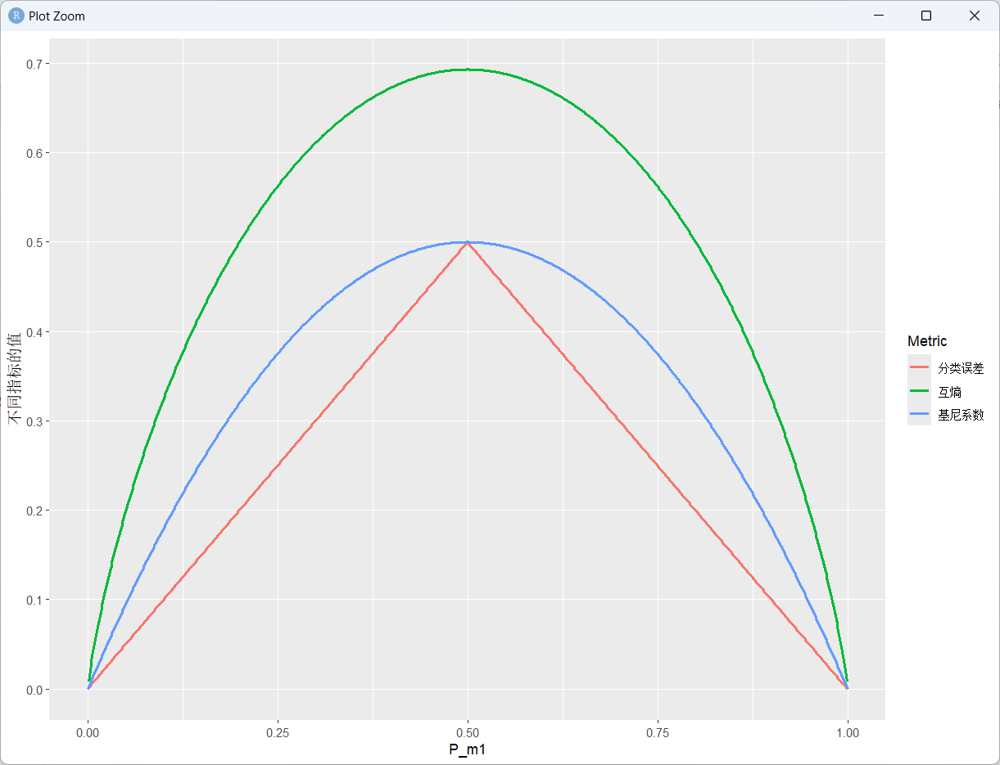

**[扩展与详解]**
*   **圖形解讀**：
    *   橫軸 $p_{m1}$ 是節點中類別 1 的比例。
    *   **分類錯誤率**：當 $p_{m1} < 0.5$ 時，錯誤率為 $p_{m1}$；當 $p_{m1} > 0.5$ 時，錯誤率為 $1-p_{m1}$。這是一條 V 形的折線。
    *   **基尼係數和互熵**：都是倒 U 形的平滑曲線，在 $p_{m1}=0.5$（最不純）時達到最大值，在 $p_{m1}=0$ 或 $1$（最純）時為 0。
    *   **關鍵觀察**：Gini 和 Entropy 的曲線總是在分類錯誤率曲線的上方。這表明它們對節點純度的變化比分類錯誤率更敏感，因此更適合用來指導樹的生長。

### 樹的剪枝

上述方法在訓練集取得良好預測效果，但是可能造成過擬合，更好的策略是生成一個很大的樹$T_0$，然後通過剪枝得到子樹

剪枝的目的是選出使測試集預測誤差最小的子樹

**代價複雜性剪枝**也稱**最弱聯繫剪枝**，不考慮每一棵可能的子樹，而是考慮以非負調整參數α標記的一系列子樹，每一個α的取值對應一棵子樹$T⊂T_0$，當α一定時，其對應的子樹使下式最小
$$
\sum_{m=1}^{|T|}\sum_{x_i∈Rm}(y_i-\hat{y}_{R_m})^2+α|T|
$$
$|T|$表示終端結點數，調整係數α在子樹的複雜性與訓練數據的契合度之間控制權衡，α增大：模型的偏差變大方差變小

剪枝過程：

```
(1)利用遞歸二叉分裂在訓練集中生成一顆大樹，只有當終端結點包含的觀測值個數低於某個最小值時才停止
(2)對大樹進行代價複雜性剪技，得到一系列最優子樹，子樹是α的函數
(3)利用K折交叉驗證選擇α。具體做法是將訓練集分為K折。對所有k=1,...,K，有:
	(a)對訓練集上所有不屬於第K折的數據重複步驟1和2，得到與α一一對應的子樹
	(b)求出上述子樹在第k折上的均方預測誤差
	上述操作結束後，每個α會有相應的K個均方預測誤差，對這K個值求平均，選出使平均誤差最小的α
(4)找出選定的α值在步驟2中對應的子樹中即可
```

**[扩展与详解]**
*   **剪枝的動機**：完全生長的決策樹幾乎肯定會過擬合。剪枝是一種正則化技術，旨在通過簡化樹的結構來降低方差，提高泛化能力。
*   **代價複雜性剪枝詳解**：
    *   **目標函數**：$RSS + \alpha |T|$。這與 Lasso 和嶺回歸的目標函數思想完全一致：在擬合誤差 (RSS) 和模型複雜度（這裡用葉節點數 $|T|$ 度量）之間找到平衡。
    *   **$\alpha$ 的作用**：$\alpha$ 是懲罰參數。
        *   $\alpha = 0$：沒有懲罰，我們得到最大的樹 $T_0$。
        *   $\alpha \to \infty$：對任何分裂都施加巨大懲罰，最終只剩下一個根節點（最簡單的樹）。
    *   **算法**：對於每一個 $\alpha$ 值，都存在一個唯一的最優子樹。我們可以通過一個高效的算法（最弱環節剪枝）得到從 $\alpha=0$ 到 $\alpha=\infty$ 對應的一系列嵌套的子樹。
    *   **選擇 $\alpha$**：我們不能用測試集來選擇 $\alpha$。正確的做法是使用 **K-折交叉驗證**。對每個 $\alpha$ 值，我們計算其在所有 K 折上的平均驗證誤差，然後選擇使平均誤差最小的那個 $\alpha$。
    *   **最終模型**：用選出的最優 $\alpha$ 在**全部訓練數據**上剪枝原始大樹 $T_0$，得到最終模型。

### 決策樹評估

#### 樹與線性模型的比較

線性回歸假設了如下模型形式：
$$
f(X)=β_0+\sum_{j=1}^{P}X_jβ_j
$$
回歸樹的模型形式為：
$$
f(X)=\sum_{m=1}^{M}c_m*1_{(X∈R_m)}
$$
真實模型線性時，線性模型更好；真實模型複雜且高度非線性時，樹方法更好

**[扩展与详解]**
*   **適用場景的根本差異**：
    *   **線性模型**：假設變量之間的關係是線性的、可加的。它擅長處理變量影響獨立且平滑的場景。
    *   **樹模型**：不假設任何結構，它通過劃分區域來建模。它非常擅長捕捉**複雜的交互作用**和**非線性**關係。例如，一個樹可以輕鬆地建模“只有當年齡大於50歲且收入高於10萬時，某產品的銷量才會顯著增加”這種複雜規則。

#### 樹的優缺點
優點：
- 解釋性強，比線性回歸更好解釋
- 更接近人的決策模式
- 可以使用圖形表示，非專業人士輕鬆解釋
- 可以直接處理定性的預測變量而不需創建啞變量


缺點：
- 預測準確率一般低於其他回歸和分類方法的水平

**[扩展与详解]**
*   **優點詳解**：
    *   **解釋性 (White Box)**：樹的結構是一系列 if-then 規則，非常直觀。
    *   **處理定性變量**：樹的分裂可以直接基於定性變量的類別（如 `if color is Red`），無需像線性回歸那樣轉換為啞變量。
    *   **對數據縮放不敏感**：因為分裂只基於排序，所以不需要對數據進行標準化。
*   **缺點詳解**：
    *   **預測準確率低**：單棵樹的預測性能通常不高，因為它的預測是分段常數，不夠平滑。
    *   **不穩定性 (高方差)**：訓練數據的微小變化可能導致生成完全不同的樹結構。這是樹模型最大的弱點。
    *   **對軸向分裂的偏好**：傳統決策樹的分裂都是平行於坐標軸的，這使得它很難擬合對角線方向的決策邊界。

### 裝袋法、隨機森林和提升法

#### 裝袋法

##### 基本概念

基本思想/目的：對一組觀測求平均可以減小方差

從總體中抽取多個訓練集，對每個訓練集分别建立預測模型，再對由此得到的多个預測值求平均
$$
\hat{f}_{avg}(x)=\frac{1}{B}\sum_{b=1}^{B}\hat{f}^b(x)
$$
求平均的具體方法：多數投票（majority vote），將B個預測中出現頻率最高的類作為總體預測

**[扩展与详解]**
*   **裝袋法 (Bagging)** 是 Bootstrap Aggregating 的縮寫。
*   **核心機制**：
    1.  **Bootstrap**：通過自助法（有放回抽樣）從原始訓練集中生成 B 個不同的訓練集。
    2.  **Aggregating**：在這 B 個訓練集上分別訓練 B 個獨立的模型（通常是完全生長的決策樹），然後將它們的預測結果進行平均（回歸問題）或多數投票（分類問題）。
*   **為何有效**：決策樹是低偏差、高方差的模型。對 B 個高方差模型求平均，可以有效地**降低方差**，同時保持偏差不變。這極大地提高了模型的穩定性和預測準確率。

##### 袋外誤差估計

平均每棵樹能利用約三分之二的觀測值，剩餘三分之一沒有使用的觀測稱為此樹的袋外（out-of-bag，OOB）觀測值

可以用所有將第i個觀測值作為OOB的樹來預測第i個觀測值的響應值，則有B/3個對第i個觀測值的預測，對這些值計算總體的OOB均方誤差（對回歸問題）或分類誤差（對分類問題），由此得到的OOB誤差是對裝袋法模型測試誤差的有效估計

**[扩展与详解]**
*   **OOB 的巨大優勢**：它提供了一種在模型訓練過程中**免費**獲得測試誤差估計的方法，無需額外劃分驗證集或進行交叉驗證。這使得 Bagging 和隨機森林在計算上非常高效。

##### 變量重要性

對基尼係數平均減小值最多的變量

**[扩展与详解]**
*   **計算方法**：
    1.  對於 Bagging 中的每一棵樹，記錄下每個變量在每次分裂時帶來的不純度（如 Gini）的總減少量。
    2.  將一個變量在所有 B 棵樹上的不純度總減少量進行平均。
    3.  這個平均值越大，說明該變量在分裂中起到的作用越重要。
*   另一種更可靠的方法是**置換重要性 (Permutation Importance)**：隨機打亂某個變量的值，看 OOB 誤差上升了多少。上升得越多，說明該變量越重要。

#### 隨機森林

##### 基本概念

基本思想/目的：根分裂結點基本上都是最重要的預測變量，導致裝袋法中抽取的樹高度相關。故每次分裂點隨機取變量，對樹作去相關處理，降低模型方差

每次考慮樹上的一個分裂點，從全部的p個變量中隨機（每次都隨機）選m個，作為候選變量。這次的分裂點只能從這m個中挑選，通常$m≈\sqrt{p}$

**[扩展与详解]**
*   **隨機森林 (Random Forest) = Bagging + 特徵隨機化**
*   **動機**：如果數據中有一個非常強的預測變量，那麼在 Bagging 中，幾乎每一棵樹的根節點都會選擇這個強變量進行分裂。這導致所有 B 棵樹的結構非常相似，它們的預測結果高度相關。對高度相關的變量求平均，方差下降得不夠多。
*   **改進**：隨機森林在每個節點分裂時，並不是從全部 p 個變量中尋找最優分裂，而是先**隨機抽取 m 個變量**的子集，然後再從這個子集中尋找最優分裂。
*   **效果**：這種特徵隨機化**強制**使得不同的樹使用不同的變量進行分裂，增加了樹之間的多樣性，降低了它們之間的相關性。這使得求平均後的方差能得到更大幅度的降低。

#### 提升法

##### 基本概念

目的：降低學習率，舒緩的迭代，使模型預測效果變好

1.對訓練集中的所有i，令$\hat{f}(x=0)$，$r_i=y_i$

2.對$b=1,2,...,B$重複以下過程

​	（a）對訓練數據$(X,r)$建立一棵有d個分裂點的樹$\hat{f}^b$

​	（b）將壓縮後的新樹加入模型以更新$\hat{f}$：
$$
\hat{f}(x)⬅\hat{f}(x)+λ\hat{f}^b(x)
$$
​	（c）更新殘差：
$$
r_i⬅r_i-λ\hat{f}^b(x)
$$
3.輸出經過提升的模型：
$$
\hat{f}(x)=\sum_{b=1}^{B}λ\hat{f}^b(x)
$$

**[扩展与详解]**
*   **提升法 (Boosting) 的核心思想**：與 Bagging 的並行學習不同，Boosting 是一種**串行**的、緩慢的學習過程。它通過迭代地擬合**殘差**來逐步改進模型。
*   **算法直觀理解**：
    1.  先用一個非常簡單的模型（如一棵淺樹）去擬合數據，得到預測和殘差。
    2.  再用一個新的簡單模型去擬合**上一步的殘差**。這樣做的目的是讓新的模型專注於學習上一個模型犯錯的地方。
    3.  將這個新的“殘差模型”以一個很小的步長（學習率 $\lambda$）加入到總模型中。
    4.  更新殘差，然後重複這個過程。
*   **目標**：Boosting 的目標是通過逐步累加許多弱學習器（通常是淺層決策樹）來構建一個強大的預測模型。它主要是在**降低偏差**。

##### 三個參數

（1）樹的總數B：與裝袋法和隨機森林不同，B值過大可能過擬合，但是發展很緩慢，用交叉驗證來選擇B

（2）取極小正值的壓縮參數λ：控制學習速度，常取0.01或0.001，若λ很小，B則需要大一些

（3）每棵樹的分裂點數d：控制模型的複雜度，表示交互深度，d=1時（每棵樹都是一個樹樁）通常效果上佳。樹更小模型解釋性更強，用樹樁會得到所謂加法模型

**[扩展与详解]**
*   **超參數的權衡**：
    *   **B (樹的數量)**：Boosting 與 Bagging/RF 不同，B 不是越大越好。因為 Boosting 會持續擬合殘差，如果樹太多，最終會開始擬合訓練集中的噪聲，導致過擬合。需要通過交叉驗證找到最優的 B。
    *   **$\lambda$ (學習率/收縮參數)**：控制每次迭代的步長。$\lambda$ 越小，學習過程越慢，需要的 B 就越大，但通常能獲得更好的泛化性能。$\lambda$ 和 B 之間存在權衡。
    *   **d (交互深度)**：控制每棵弱學習器樹的深度。d=1 意味著每棵樹只有一次分裂（稱為樹樁），模型是一個可加模型。d 增加可以捕捉變量間的交互作用，但也會增加過擬合的風險。


## 第九章 支持向量機

### 最大間隔分類器

#### 超平面

比如二維超平面：
$$
β_0+β_1X_1+β_2X_2=0
$$
p維超平面：
$$
β_0+β_1X_1+β_2X_2+...+β_pX_p=0
$$
使用超平面分類數據點
$$
β_0+β_1X_1+β_2X_2+...+β_pX_p>0，如果y_i=1
$$

$$
β_0+β_1X_1+β_2X_2+...+β_pX_p<0，如果y_i=-1
$$

等價於
$$
y_i(β_0+β_1X_1+β_2X_2+...+β_pX_p)>0
$$

**[扩展与详解]**
*   **超平面的幾何意義**：在 p 維空間中，超平面是一個 p-1 維的子空間。
    *   p=2（二維平面）：超平面是一條直線。
    *   p=3（三維空間）：超平面是一個平面。
*   **分類規則**：超平面將整個特徵空間一分為二。位於一側的點被分為一類，另一側的點被分為另一類。$f(X) = \beta_0 + \beta_1X_1 + \dots$ 的**符號**決定了分類結果。

#### 最大間隔超平面

某種意義上說是能夠插入兩個類别之間的“最寬的平板”的中線

構建最大間隔分類器，就是如下優化問題的解
$$
\mathop{maximize}\limits_{β_0,β_1,...,β_p}M
$$
滿足
$$
\sum_{j=1}^{p}β_j^2=1
$$

$$
y_i(β_0+β_1X_{i1}+β_2X_{i2}+...+β_pX_{ip})≥M,i=1,...,n
$$

M大於0，代表了超平面的間隔，優化問題就是找出最大化M時的$β_0,β_1,...,β_p$

可能存在線性不可分的情況

**[扩展与详解]**
*   **間隔 (Margin)**：間隔是指分割超平面與離它最近的任何訓練樣本之間的最小距離。最大間隔分類器的目標就是找到一個能使這個最小距離（即間隔）最大化的超平面。
*   **動機**：直觀上，一個有更大間隔的分類邊界對數據的微小擾動更不敏感，泛化能力更強。
*   **約束條件解釋**：
    *   $\sum \beta_j^2 = 1$：這是一個尺度約束，確保了間隔 M 的定義是唯一的。
    *   $y_i(\dots) \ge M$：這個核心約束要求**所有**數據點都必須被正確分類，並且距離超平面的距離至少為 M。
*   **局限性**：最大間隔分類器要求數據是**完全線性可分**的。只要有一個離群點，或者數據本身就存在重疊，就無法找到滿足條件的超平面。

### 支持向量分類器

為了提高分類器對單個觀測分類的穩定性以及使大部分訓練觀測更好地被分類，允許被誤分類
$$
\mathop{maximize}\limits_{β_0,β_1,...,β_p}M
$$
滿足
$$
\sum_{j=1}^{p}β_j^2=1
$$

$$
y_i(β_0+β_1X_{i1}+β_2X_{i2}+...+β_pX_{ip})≥M(1-ε_i)
$$

$$
ε_i≥0,\sum_{i=1}^{n}ε_i≤C
$$

C是非負的調節參數，C增大，允許穿過間隔的點就更多，方差減小偏差增大

$ε_i$是松弛變量，允許小部分觀測可以落在間隔錯誤或是超平面錯誤的一側
#### 最大間隔分類器
在所有分離超平面中，找出使兩類之間的間隙或間隔最大的超平面。

首先，計算每個訓練觀測到一個分割超平面的距離，取最小值，稱為間隔（margin）。這個間隔值最大的那個分割超平面即為最大間隔超平面。

然後，用此最大間隔超平面判斷測試樣本落在哪一側，就可以分類。此為最大間隔分類器。
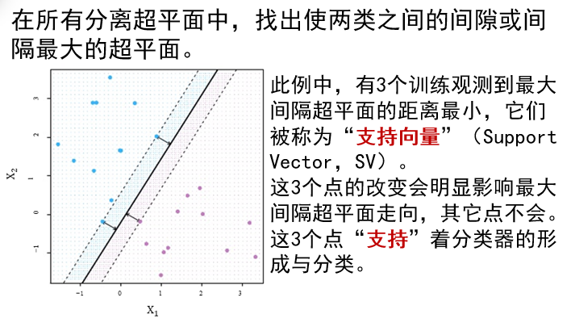

#### 支持向量

剛好落在間隔上和落在間隔錯誤一側的觀測叫做**支持向量**，只有這些觀測會影響支持向量分類器

#### 支持向量分類器
只要求超平面幾乎能夠把類别區分開，即使用所謂的軟間隔( soft
margin) 。**最大間隔分類器**在線性不可分情况
下的推廣叫做支持向量分類器 (support vector classifier)。
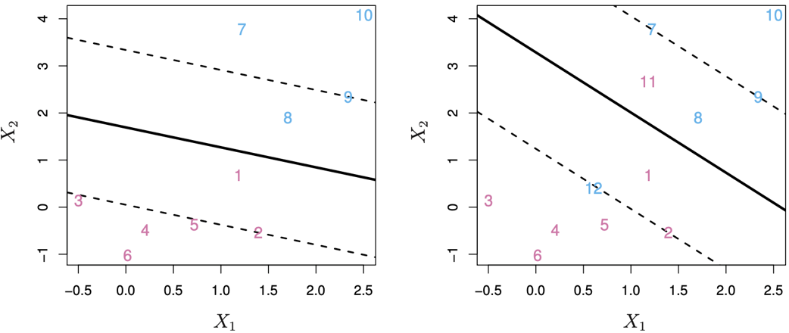
##### 軟間隔範圍限定
$$
y_i(β_0+β_1x_{i1}+β_2x_{i2}+...+β_1p_{ip})≥M(1-ε_i)
$$
$$
ε_i≥0,\sum_{i=1}^{n}ε_i≤C,\sum_{j=1}^{p}β_{j}^2=1
$$
怎麼調整C限制𝜖𝑖,使得超平面雖被violated，但能在接受範圍内?
𝜖𝑖：0，正確間隔；>0，錯誤間隔；>1(右式為負數)，錯誤超平面側。

C：0，所有𝜖𝑖為0，不允許穿過間隔；>0，最多可以有C個觀測落到超平面錯誤一側，因為每個錯誤落側都對應其𝜖𝑖>1(因為得為負)。至於穿過間隔多少個，無法說
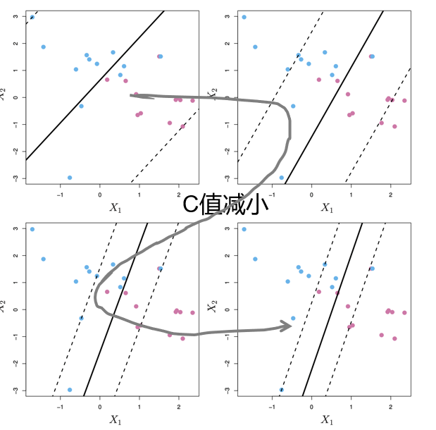

**[扩展与详解]**
*   **軟間隔 (Soft Margin)**：支持向量分類器引入了軟間隔的概念，以處理線性不可分和噪聲數據。
*   **松弛變量 $\epsilon_i$**：它衡量了第 $i$ 個觀測點違反間隔的程度。
    *   $\epsilon_i = 0$：該點在間隔邊界上或在正確的一側。
    *   $0 < \epsilon_i \le 1$：該點在間隔內部，但仍在正確的一側。
    *   $\epsilon_i > 1$：該點被**錯誤分類**。
*   **調節參數 C**：它是在「最大化間隔」和「最小化違反間隔的總量 $\sum \epsilon_i$」之間的權衡參數，也稱為代價參數。
    *   **大 C**：對違反間隔的懲罰很重。分類器會盡力將所有點都正確分類，這可能導致間隔變窄，模型變得複雜，容易**過擬合**（低偏差，高方差）。
    *   **小 C**：對違反間隔的懲罰很輕。分類器會容忍更多的點違反間隔，以換取一個更寬的間隔，模型更簡單，泛化能力可能更強（高偏差，低方差）。
*   **支持向量的重新定義**：在軟間隔下，支持向量是所有 $\epsilon_i > 0$ 的點，即所有**位於間隔內部或被錯誤分類**的點。

#### 非線性決策邊界分類

如果預測變量和響應變量之間的關係是非線性的，可以使用預測變量的高階多項式來擴大特徵空間

比如可以使用2p個特徵（多包含了二次項）來得到支持向量分類器：
$$
\mathop{maximize}\limits_{β_0,β_{11},β_{12}，...,β_{p1}，β_{p2},ε_1,ε_2,...,ε_n}M
$$
滿足
$$
y_i(β_0+\sum_{j=1}^{p}β_{j1}x_{ij}\sum_{j=1}^{p}β_{j2}x_{ij}^2)≥M(1-ε_i)
$$

$$
ε_i≥0,\sum_{i=1}^{n}ε_i≤C,\sum_{j=1}^{p}\sum_{k=1}^{2}β_{jk}^2=1
$$


**[扩展与详解]**
*   **思路**：這是解決非線性問題的一種直接但笨拙的方法。通過手動添加多項式項、交互項等，將原始的特徵空間映射到一個更高維的空間，並希望在這個高維空間中數據是線性可分的。
*   **問題**：
    1.  **維度災難**：特徵空間的維度會急劇膨脹。
    2.  **計算複雜**：在高維空間中求解優化問題計算成本很高。
    3.  **形式未知**：我們通常不知道應該添加什麼樣的非線性項。

### 支持向量機

是支持向量分類器的一個擴展，使用**核函數**來擴大特徵空間

內積：兩個p維向量a和b的**內積**定義為
$$
<x_i,x_{i'}>=\sum_{j=1}^{p}x_{ij}x_{i'j}
$$

##### 線性支持向量分類器

線性支持向量分類器可以描述為
$$
f(x)=β_0+\sum_{i=1}^{n}α_i<x,x_i>
$$
式子有n個參數$α_i$，每個訓練觀測對應一個參數

為了估計$α_i$和$β_0$，只需要所有訓練觀測的$C_n^2$個成對組合的內積$<x_i,x_{i'}>$

注意：非支持向量的觀測的$α_i$=0

用一種一般化的形式$K(x_i,x_{i'})$來代替內積，這裡K是一個核函數，用來衡量觀測之間相似性的函數

比如使用簡單的核函數$K(x_i,x_{i'})=\sum_{j=1}^{p}x_{ij}x_{i'j}$（**線性核函數**），即此時核函數就是$x_i$和$x_{i'}$的內積

###### 核函數

核函數的主要作用是通過隱式映射將數據從原始的輸入空間映射到一個更高維的特徵空間，在高維空間中，數據可能變得線性可分，從而可以使用線性分類器解決原本的非線性問題。

**[扩展与详解]**
*   **核技巧 (Kernel Trick)**：這是 SVM 的精髓。通過數學上的對偶問題轉換，人們發現支持向量分類器的求解和預測過程，實際上只依賴於數據點之間的**內積** $<x_i, x_{i'}>$。
*   **核心思想**：如果我們想在一個高維的特徵空間 $\phi(x)$ 中進行分類，我們並不需要知道映射函數 $\phi$ 的具體形式，也不需要在高維空間中進行計算。我們只需要找到一個在**低維原始空間**中計算的**核函數 $K(x_i, x_{i'})***，使得它的計算結果**等於**高維空間中的內積 $<\phi(x_i), \phi(x_{i'})>$ 即可。
*   **優勢**：核技巧極大地降低了計算複雜度，使得在高維甚至無窮維空間中進行分類成為可能。

##### 自由度為d的多項式核函數

$$
K(x_i,x_{i'})=(1+\sum_{j=1}^{p}x_{ij}x_{i'j})^d
$$

和標準的線性核函數相比，能生成光滑度更高的決策邊界

支持向量分類器與這樣的非線性核函數的結合，就是**支持向量機**

這種情況下非線性核函數的形式為$f(x)=β_0+\sum_{i∈S}α_iK(x,x_i)$

##### 徑向核函數

$$
K(x_i,x_{i'})=exp(-γ\sum_{j=1}^{p}(x_{ij}-x_{i'j})^2)
$$

原理是以歐氏距離衡量，離測試觀測遠的訓練觀測的影響很小，某種意義上徑向核函數是一種局部方法

**[扩展与详解]**
*   **多項式核**：它隱式地將數據映射到一個包含所有直到 d 次項的多項式特徵空間。d 越大，決策邊界越靈活。
*   **徑向基核函數 (Radial Basis Function, RBF)**：
    *   這是最常用、最强大的核函數之一。它隱式地將數據映射到一個**無窮維**的特徵空間。
    *   **局部性**：RBF 核的值只取決於兩個點之間的歐氏距離的平方。如果一個測試點 $x$ 離某個支持向量 $x_i$ 很遠，那麼 $K(x, x_i)$ 的值就趨近於 0，這個支持向量對 $x$ 的預測就沒有影響。因此，RBF-SVM 的決策是**局部**的。
    *   **參數 $\gamma$**：控制了核函數的“寬度”。$\gamma$ 越大，核函數越窄，決策邊界越彎曲，越容易過擬合。

##### 使用核函數的優勢

計算量更小

- 核函數只需要為$C_n^2$個不同對配對$i,i'$計算$K(x_i,x_i')$
- 而在擴大的特徵空間中沒有明確的計算量

### 多分類的SVM(support vector machine)

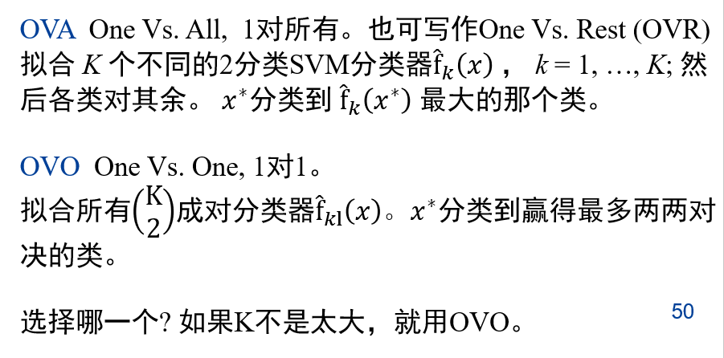
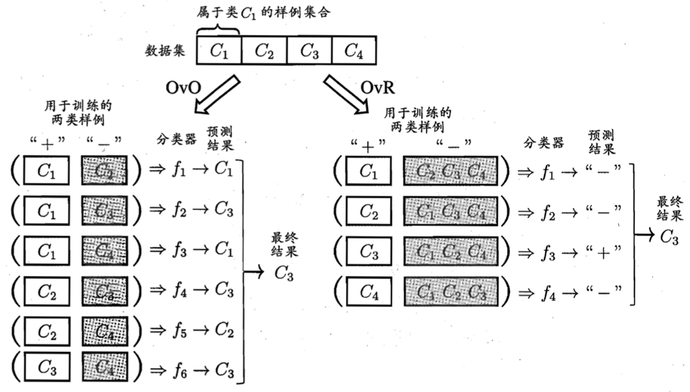

**[扩展与详解]**
*   SVM 本質上是二分類器。處理多分類問題（K > 2）通常採用以下兩種策略：
    1.  **一對餘 (One-vs-Rest, OVR)**：構建 K 個分類器。第 k 個分類器將類別 k 的樣本視為正類，將所有其他 K-1 個類別的樣本視為負類。預測時，將新樣本輸入所有 K 個分類器，選擇置信度最高的那個類別。
    2.  **一對一 (One-vs-One, OVO)**：在任意兩個類別之間都構建一個分類器，總共需要構建 $C_K^2 = K(K-1)/2$ 個分類器。預測時，新樣本在所有分類器上進行“投票”，得票最多的類別即為最終結果。
*   **比較**：OVO 需要訓練更多的分類器，但在每個分類器上訓練的數據量更少，計算上可能更高效，尤其在 K 很大時。在實踐中，OVO 的性能通常略優於 OVR。


## 第十章 無監督學習
### 主成分分析 PCA
PCA產生一個對數據集的低維表示。它可以找到具有最大方差且互不相關的變量的線性組合序列。
#### 標準化
$$
𝑍_1=𝜙_{11} 𝑋_1+𝜙_{21} 𝑋_2+…+𝜙_{p1} 𝑋_𝑝
$$
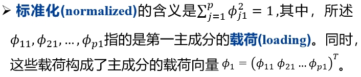
主成分受變量度量單位的選擇影響，會導致結果的任意性。通常在進行PCA之前，需要將每個變量都標準化，使得它們的方差都為1。
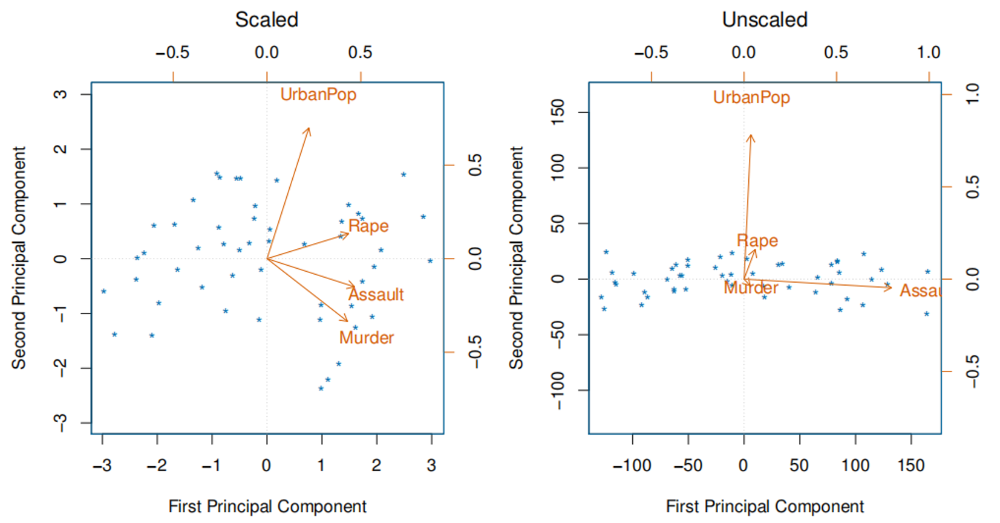

**[扩展与详解]**
*   **PCA 的目標**：
    1.  **最大化方差**：找到一個新的坐標系（由主成分構成），使得數據在第一個坐標軸（第一主成分 $Z_1$）上的投影方差最大，在第二個坐標軸（第二主成分 $Z_2$）上的投影方差次大，以此類推。
    2.  **最小化重構誤差**：等價地，找到一個低維超平面，使得所有數據點到這個超平面的投影距離平方和最小。
*   **主成分的性質**：
    *   每個主成分都是原始變量 $X_1, \dots, X_p$ 的一個**線性組合**。
    *   所有主成分之間**相互正交（不相關）**。
*   **載荷向量 (Loading Vector)**：公式中的 $\phi_{j1}$ 是第 j 個變量在第一主成分上的載荷。載荷向量描述了如何從原始變量線性組合成主成分。
*   **為何要標準化**：PCA 完全由數據的協方差矩陣決定。如果變量的單位不同（如身高用米，體重用千克），那麼數值範圍大的變量（體重）將在方差計算中佔據主導地位，導致 PCA 主要反映這個變量的變化，而忽略其他變量。標準化（使所有變量均值為0，標準差為1）消除了量綱影響，使得每個變量在 PCA 中都有平等的貢獻機會。

### 聚類分析法
聚類分析(clustering)是在一個數據集中尋找子群(subgroups)或類(clusters)的技術，應用非常廣泛。

#### K均值聚類(K-means clustering)
試圖將觀測劃分到事先規定數量的類中。
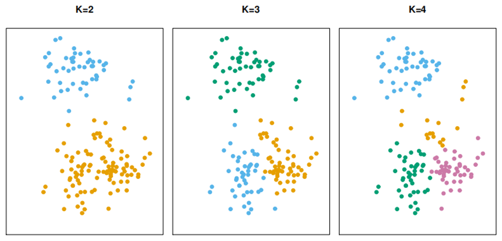
K均值聚類法的思想是，一個好的聚類法可以使類內差異(within-cluster variation)尽可能小。
算法
>1. 為每個觀測隨機分配一個從1到K的數字。這些數字可以看作對這些觀測的初始類。
>2. 重複下列操作，直到類的分配停止為止：
>2.1 分別計算K個類的類中心。第k個類中心(centroid)是第k個類中的p維觀測向量的均值向量。
>2.2 將每個觀測分配到距離其最近的類中心所在的類中（用歐式距離定義“最近(closest)”）。

**[扩展与详解]**
*   **目標函數**：K-Means 旨在最小化**類內平方和 (Within-Cluster Sum of Squares, WCSS)**，即每個數據點到其所屬類簇中心點的距離平方之和。
*   **算法的迭代本質**：K-Means 算法是一個迭代優化過程，交替執行兩個步驟：
    1.  **分配步驟**：固定類中心，將每個點分配給最近的中心。
    2.  **更新步驟**：固定點的分配，重新計算每個類的中心（均值）。
    這個過程保證了目標函數 WCSS 在每一步都會下降或不變，最終會收斂。
*   **缺點**：
    1.  **需要預先指定 K**：K 值的選擇對結果影響巨大，通常需要藉助肘部法則或輪廓係數等方法來輔助確定。
    2.  **對初始中心敏感**：不同的初始中心可能導致收斂到不同的局部最優解。標準做法是多次隨機初始化，選擇 WCSS 最小的結果。
    3.  **對非球形簇和異常值敏感**：因為基於均值和歐氏距離，K-Means 傾向於發現大小相似的球形簇，對形狀不規則的簇和離群點表現不佳。

#### 系統聚類(hierarchical clustering)
並不需要事先規定所需的類數。我們最後會通過分析觀測的樹型表示，即譜系圖(dendrogram)來確定類數。通過看譜系圖還可以馬上獲得從1類到𝑛類類數不等的分類情況。

算法
>  從譜系圖的底部開始，𝑛個觀測各自都被看作一類
 再將兩個最為相似的類匯合到一起，就得到了𝑛−1個類；
 然後再把兩個最為相似的類匯合到一起，就得到了𝑛−2個類；
 如此進行下去，到所有觀測都屬於某一個類時停止

 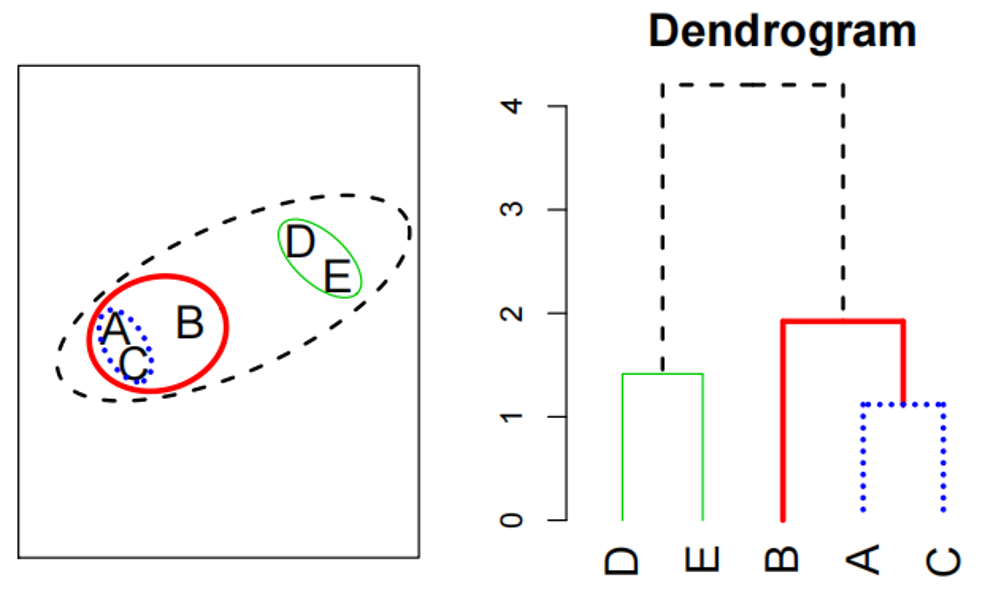

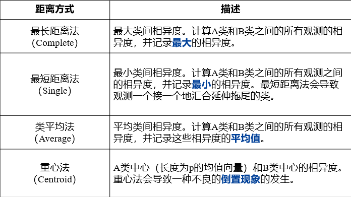

**[扩展与详解]**
*   **算法類型**：這裡描述的是**凝聚型 (Agglomerative)** 的層次聚類，即自底向上地合併。還存在分裂型 (Divisive) 的，即自頂向下地分裂。
*   **關鍵要素：聯結方法 (Linkage)**：算法的核心在於如何定義兩個**類簇**之間的距離（相似度）。常用的聯結方法有：
    *   **Complete (最長距離)**：類間距離定義為兩個類簇中**最遠**的兩個點之間的距離。傾向於產生緊湊、大小相似的球形簇。
    *   **Single (最短距離)**：定義為兩個類簇中**最近**的兩個點之間的距離。可以處理非球形簇，但容易受噪聲影響，產生“鏈式”效果。
    *   **Average (平均距離)**：定義為兩個類簇中所有點對之間距離的平均值。是 Complete 和 Single 的一種折衷。
    *   **Centroid (中心距離)**：定義為兩個類簇的中心點之間的距離。
*   **樹狀圖 (Dendrogram) 解讀**：
    *   **縱軸**：代表合併時的距離（或不相似度）。合併發生的高度越高，說明這兩個類簇的差異越大。
    *   **確定類簇數量**：通過在樹狀圖上畫一條水平線來“切割”。水平線與多少條垂直線相交，就得到了多少個類簇。通常選擇在垂直線最長、跨度最大的地方切割，因為這意味著這次合併是在差異很大的類簇之間進行的。


##  第十一章 各模型評測
###  各模型偏差-方差均衡以及光滑度-可解釋性均衡

####  偏差-方差均衡

| 模型           | 偏差減小，方差增大 | 方差減小，偏差增大 |
| -------------- | ------------------ | ------------------ |
| 線性回歸       | 係數個數增多       | 係數個數減少       |
| K最近鄰（KNN） | K減小              | K增大              |
| 嶺回歸/Lasso   | λ減小              | λ增大              |
| 多項式回歸     | 最高項次數增大     | 最高項次數減小     |
| 階梯函數       | 分割點個數增多     | 分割點個數減少     |
| 回歸樣條       | 自由度增大         | 自由度減小         |
| 光滑樣條       | λ減小              | λ增大              |
| 局部回歸       | 比例s減小          | 比例s增大          |
| 廣義可加模型   | --                 | --                 |
| 決策樹         | α減小              | α增大              |
| 支持向量分類器 | C減小/cost值增大   | C增大/cost值減小   |

**[扩展与详解]**
*   **核心規律**：表格左側的變化都對應於**增加模型複雜度（靈活性）**，右側則對應於**降低模型複雜度**。
    *   **增加複雜度** $\implies$ 模型能更好地擬合訓練數據 $\implies$ **偏差減小**。
    *   **增加複雜度** $\implies$ 模型更容易擬合噪聲，對訓練數據更敏感 $\implies$ **方差增大**。
*   **GAM 的情況**：廣義可加模型本身的結構是固定的（可加），其偏差-方差權衡體現在用於擬合每個 $f_j$ 的平滑器上。例如，如果用樣條擬合，其自由度就決定了 GAM 的複雜度。
*   **SVM 的情況**：這裡的 C 是軟間隔 SVM 中的代價參數。
    *   **C 增大**：對誤分類的懲罰變重，模型試圖將更多點正確分類，導致決策邊界更扭曲，間隔更窄。模型更複雜，**偏差減小，方差增大**。
    *   **C 減小**：容忍更多誤分類，追求更寬的間隔。模型更簡單，**偏差增大，方差減小**。
    *   *注意：原文表格中 SVM 部分的描述存在**混淆和錯誤**。正確對應關係如上所述。*

####  光滑度-可解釋性均衡


**[扩展与详解]**
*   **圖形解讀**：
    *   **橫軸 (靈活性/光滑度)**：從左到右，模型的複雜度增加。
    *   **縱軸 (可解釋性)**：從下到上，模型的可解釋性增強。
*   **模型位置分析**：
    *   **右下角（低解釋性，高靈活性）**：集成方法（Bagging, Boosting, RF）和帶核函數的 SVM。它們是預測性能的王者，但內部機制複雜，是典型的“黑箱”模型。
    *   **左上角（高解釋性，低靈活性）**：子集選擇、Lasso、線性回歸。模型結構簡單，每個變量的影響清晰可見，但無法捕捉複雜的非線性關係。
    *   **中間區域**：GAMs 和決策樹。它們在靈活性和可解釋性之間取得了較好的平衡。GAMs 允許非線性但保持可加性，樹的規則也相對直觀。

###  置信區間和預測區間的區別
區別

| **屬性**              | **置信區間 (CI)**                               | **預測區間 (PI)**                           |
|-----------------------|-----------------------------------------------|-------------------------------------------|
| **目的**              | 估計**總體平均值**的範圍                         | 估計**單個預測值**的範圍                     |
| **包含內容**          | 僅包含模型的不確定性（標準誤差 $SE$）            | 包含模型不確定性 + 數據固有波動（$\sigma$） |
| **區間寬度**          | 相對較窄                                      | 相對較寬                                  |
| **應用場景**          | 用於描述模型對總體均值預測的精度                  | 用於預測新數據點的可能範圍                   |
| **解釋方式**          | “在95%的置信水平下，真實的均值落在區間内。”         | “在95%的置信水平下，未来的某个值落在區間内。” |

**[扩展与详解]**
*   **一個直觀的例子**：
    *   **場景**：我們建立了一個模型，根據學習時間 ($X$) 預測考試成績 ($Y$)。
    *   **置信區間 (CI)**：回答的問題是：“所有學習時間為 10 小時的學生的**平均成績**會是多少？” 我們可能會得到一個區間 [80, 85]。這個區間比較窄，因為大量學生的平均成績是一個比較穩定的值。它只關心我們的回歸線在 $X=10$ 這一點上的不確定性。
    *   **預測區間 (PI)**：回答的問題是：“**某一個**學習了 10 小時的學生（比如小明），他這次考試的成績會是多少？” 我們可能會得到一個區間 [70, 95]。這個區間必須**更寬**，因為它不僅要考慮我們對平均成績預測的不確定性（回歸線可能上下浮動），還要考慮小明這個**個體**的隨機波動（不可約誤差 $\epsilon$），比如他考試當天的狀態、運氣等。
*   **數學公式**：
    *   CI 寬度 $\propto SE(\hat{f}(x_0))$
    *   PI 寬度 $\propto \sqrt{SE(\hat{f}(x_0))^2 + \hat{\sigma}^2}$
    *   可以看出，預測區間的寬度是在置信區間的基礎上，額外加上了數據自身的噪聲方差 $\hat{\sigma}^2$。


***


# 最小二乘法的最优子集选择法 - 优缺点
## 优点

1. **提升模型的准确性**  
   - **选择重要变量**：最优子集法通过选择最相关的自变量来构建回归模型，避免了无关变量对模型性能的干扰，从而提高了模型的预测能力。
   - **避免过拟合**：通过选择合适的子集，去除冗余或不相关的变量，可以防止模型复杂度过高，从而减少过拟合现象。

2. **简化模型**  
   - **提高模型的可解释性**：通过选择少量重要的特征，简化了模型，使得模型更易于理解和解释。这对于一些需要解释变量作用的应用（如经济学、医学等）非常重要。
   - **减少多重共线性**：如果某些自变量之间存在高度相关性，最优子集法可以有效地选择去除冗余的变量，从而减少共线性问题，改善模型稳定性。

3. **灵活性强**  
   - **多种选择方法**：最优子集法提供了多种实现方式，如穷举法、前向选择、后向剔除和逐步选择，允许根据不同的需求和数据集选择最适合的算法。

4. **能够获得全局最优解（穷举法）**  
   - **穷举法**：在小规模数据集中，使用穷举法可以找到所有变量子集中的全局最优解，确保模型选择的是最好的自变量组合。

**[扩展与详解]**

*   **关于“灵活性强”的澄清**：
    *   严格来说，**最优子集选择 (Best Subset Selection)** 通常特指**穷举法**，即遍历所有可能的组合。
    *   **逐步选择 (Stepwise Selection)**（前向、后向）通常被视为最优子集选择的**贪心近似算法**。原文将它们归为一类，是因为它们的目标一致：都是为了从 $p$ 个变量中选出一个子集。
    *   **Leaps and Bounds 算法**：在实际计算中，对于中等规模的 $p$（如 $p < 40$），我们可以使用 "Leaps and Bounds" 算法来加速最优子集的搜索，而不需要完全遍历所有 $2^p$ 个模型。它利用分支定界法排除那些明显不可能成为最优的子集分支。
*   **全局最优的意义**：
    *   对于固定的模型大小 $k$，最优子集法保证找到 RSS 最小的那个模型。这是逐步选择法无法保证的（逐步法可能因为早期的错误选择而错过全局最优）。

## 缺点

1. **计算开销大**  
   - **高计算复杂度**：穷举法的计算复杂度为 \(2^p\)，其中 \(p\) 是自变量的数量，这意味着当自变量数量很大时，穷举法的计算开销非常大。在变量很多的情况下，这种方法可能不切实际。
   - **高维数据的挑战**：随着特征数量的增加，计算量会迅速增加，尤其在高维数据集下，最优子集选择可能变得不可行。

2. **可能陷入局部最优解（逐步选择方法）**  
   - **前向选择和后向剔除的局限性**：逐步选择方法（如前向选择、后向剔除）并不能保证全局最优解，可能只找到局部最优解。例如，前向选择方法可能在开始时选择了一个次优的变量组合，进而影响后续的选择。
   - **需要多次尝试**：这些方法可能无法捕捉到变量之间的复杂相互作用，特别是对于非线性关系，可能导致子集选择的不足。

3. **可能过于依赖于数据**  
   - **数据的敏感性**：最优子集法的结果可能对训练数据非常敏感，尤其是在数据量较小或存在噪声的情况下。小的波动或噪声可能导致子集选择发生显著变化。
   - **不适应新数据**：如果训练数据与未来预测数据分布不同，选择的最优子集可能无法适应新数据，从而影响模型的泛化能力。

4. **可能忽略变量间的相互作用**  
   - **变量间交互作用的忽略**：最优子集选择方法通常独立地考虑每个变量，而忽略了变量之间的交互作用。在某些情况下，变量之间的交互作用对因变量的影响可能非常重要，而传统的最优子集选择方法可能无法捕捉到这一点。

5. **选择标准的依赖性**  
   - **选择标准影响结果**：最优子集选择方法的结果通常依赖于所使用的选择标准（如AIC、BIC、交叉验证等）。不同的标准可能导致选择的变量子集有所不同，因此需要谨慎选择标准。
   - **过度依赖统计量**：一些方法（如逐步选择）可能过度依赖某些统计量（如p值、AIC），忽略了模型的实际预测能力或泛化能力。

6. **不适用于非常大的数据集**  
   - **大数据挑战**：在特征非常多（例如几百到几千个自变量）的情况下，穷举法和其他逐步方法的计算成本非常高，可能无法在实际应用中使用。对于非常大的数据集，最优子集选择可能不可行。

**[扩展与详解]**

*   **计算复杂度的直观感受**：
    *   $p=10$ 时，需要拟合 $2^{10} = 1,024$ 个模型。
    *   $p=20$ 时，需要拟合 $2^{20} \approx 1,000,000$ (一百万) 个模型。
    *   $p=40$ 时，需要拟合 $2^{40} \approx 10^{12}$ (一万亿) 个模型。这就是为什么当 $p$ 稍大时，穷举法就完全失效了。
*   **选择后的推断问题 (Post-selection Inference)**：
    *   这是一个高级且重要的问题。当我们用最优子集法选出一个模型后，如果我们直接用该模型输出的 p-value 或置信区间，通常是**无效**的。因为这些统计量没有考虑到“我们是从成千上万个模型中特意挑选出这一个”的过程。这会导致我们严重低估 p-value，认为结果比实际更显著（数据疏浚/P-hacking）。
*   **高方差问题**：
    *   最优子集选择是一个**离散**的过程：一个变量要么在模型里，要么不在。数据的微小扰动可能导致最优子集从 $\{X_1, X_2\}$ 突然跳变到 $\{X_3, X_4\}$。这种不稳定性（高方差）是相对于 Lasso 或岭回歸（连续收缩）的一个主要劣势。

## 总结

最优子集选择法是一种有效的回归分析方法，特别适用于变量选择和模型简化，但也存在一定的局限性。它的主要优点是能够提高模型的预测性能，简化模型并避免过拟合，但其缺点在于计算开销大、容易陷入局部最优解，并且对于高维数据和变量间的复杂相互作用较难处理。因此，在使用最优子集选择时，通常需要平衡计算复杂度和模型的实际需求，结合其他方法（如正则化、交叉验证等）来提高模型的效果和泛化能力。


# 带有惩罚因子的模型

在回归分析、分类和其他机器学习任务中，惩罚因子用于控制模型的复杂性，以避免过拟合。以下列出了四个带有惩罚因子的模型及其公式，并对每个模型的目的进行了简要解释。

## 1. Lasso 回归 (L1 正则化)

**Lasso 回归**通过对回归系数的 L1 范数（系数绝对值之和）进行惩罚，强制一些系数变为零，从而实现特征选择。

### 公式：
\[
\hat{\beta}^{lasso} = \underset{\beta}{\text{argmin}} \left( \sum_{i=1}^{n} (y_i - X_i \beta)^2 + \lambda \sum_{j=1}^{p} |\beta_j| \right)
\]
- **目标**：通过加入 L1 惩罚项，Lasso 回归会选择较少的特征并使得某些系数变为零，进而自动进行特征选择。
- **解释**：Lasso 回归适用于需要从多个特征中挑选出最重要特征的情况。

**[扩展与详解]**

*   **软阈值算子 (Soft Thresholding)**：
    *   在正交设计（即 $X$ 的列向量相互正交）的特殊情况下，Lasso 的解有显式公式：
        $$ \hat{\beta}_j^{lasso} = \text{sign}(\hat{\beta}_j^{OLS}) \cdot \max(0, |\hat{\beta}_j^{OLS}| - \lambda/2) $$
    *   这意味着，如果最小二乘估计值 $|\hat{\beta}_j^{OLS}|$ 小于 $\lambda/2$，Lasso 就会直接将其“截断”为 0；如果大于，则将其向 0 收缩。这就是稀疏性的数学来源。
*   **局限性**：
    *   当 $p > n$ 时，Lasso 最多只能选出 $n$ 个变量。
    *   如果存在一组高度相关的变量，Lasso 倾向于只从这组变量中随机选出一个，而将其他的系数归零。这在某些需要保留所有相关变量的场景下可能是个缺点。

## 2. 岭回归 (L2 正则化)

**岭回归**通过对回归系数的 L2 范数（系数平方和）进行惩罚，约束模型参数的大小，避免模型过于复杂，防止过拟合。

### 公式：
\[
\hat{\beta}^{ridge} = \underset{\beta}{\text{argmin}} \left( \sum_{i=1}^{n} (y_i - X_i \beta)^2 + \lambda \sum_{j=1}^{p} \beta_j^2 \right)
\]
- **目标**：通过加入 L2 惩罚项，岭回归适用于处理多重共线性问题，同时防止过拟合。
- **解释**：岭回归适合于在特征数目很多或特征之间存在共线性的情况下使用。

**[扩展与详解]**

*   **比例收缩 (Proportional Shrinkage)**：
    *   同样在正交设计下，岭回归的解为：
        $$ \hat{\beta}_j^{ridge} = \frac{\hat{\beta}_j^{OLS}}{1 + \lambda} $$
    *   这表明岭回归是对最小二乘系数进行了一个**比例因子**的收缩。$\lambda$ 越大，分母越大，系数越接近 0，但永远不会等于 0。
*   **贝叶斯解释**：岭回归等价于假设系数 $\beta$ 服从均值为 0 的**高斯先验分布 (Gaussian Prior)**，并进行最大后验估计 (MAP)。

## 3. 光滑样条 (Smooth Spline)

**光滑样条**通过使用样条函数的光滑度惩罚项来拟合数据。它允许模型在数据的不同部分保持一定的平滑性。

### 公式：
\[
\hat{f}(x) = \underset{f}{\text{argmin}} \left( \sum_{i=1}^{n} (y_i - f(x_i))^2 + \lambda \int \left( f''(x) \right)^2 \, dx \right)
\]
- **目标**：通过对二阶导数的惩罚，光滑样条保证了模型的平滑性，避免过拟合并使得拟合函数具有平滑的转折。
- **解释**：光滑样条主要用于平滑数据，适合于处理平滑函数估计的问题，特别是在处理非线性关系时。

**[扩展与详解]**

*   **极限情况分析**：
    *   $\lambda \to 0$：惩罚项消失，模型退化为能够穿过所有数据点的**插值样条**。此时模型极其震荡，过拟合严重。
    *   $\lambda \to \infty$：惩罚项占主导，为了使 $\int (f'')^2 dx$ 最小（即为 0），函数 $f(x)$ 必须是线性的（二阶导数为0）。此时模型退化为**最小二乘线性回归**。
*   **有效自由度 (Effective Degrees of Freedom)**：
    *   光滑样条的灵活性不通过结点的数量来控制，而是通过 $\lambda$。虽然它有 $n$ 个参数（每个数据点一个结），但由于收缩效应，其**有效自由度** $df_\lambda$ 通常远小于 $n$。$\lambda$ 越大，$df_\lambda$ 越小。

## 4. 弹性网络 (Elastic Net) [补充扩展]

**弹性网络**结合了 Lasso 和岭回归的特点，同时使用 L1 和 L2 正则化。

### 公式：
\[
\hat{\beta}^{elastic} = \underset{\beta}{\text{argmin}} \left( RSS + \lambda_1 \sum |\beta_j| + \lambda_2 \sum \beta_j^2 \right)
\]
- **目标**：综合 Lasso 的特征选择能力和岭回归处理共线性的稳定性。
- **解释**：当存在高度相关的特征组时，Elastic Net 能够像岭回归一样将这一组变量都选入（而不是像 Lasso 那样只选一个），同时又能像 Lasso 一样剔除无关变量。

## 总结

这些带有惩罚因子的模型通过不同方式对模型的复杂度进行控制，从而防止过拟合并提升模型的泛化能力：
- **Lasso 回归**：用于特征选择。
- **岭回归**：用于处理共线性问题并控制模型的复杂度。
- **光滑样条**：用于平滑数据，处理非线性关系。
- **弹性网络**：结合了 L1 和 L2 的优势，适用于高维且存在共线性的复杂场景。

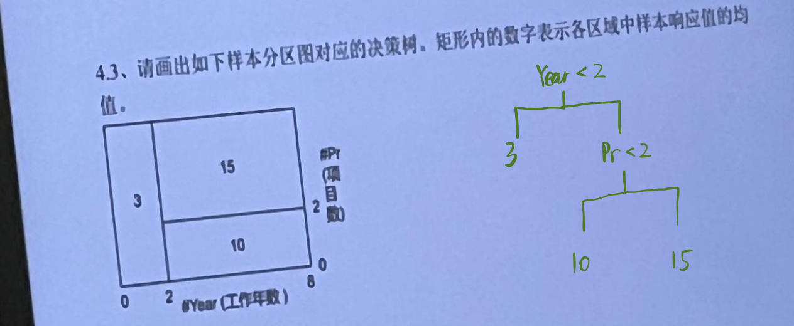

***

# R语言常见指令大全
#### 5/11/2024-19/11/2024
#### Linxi(LiLinxi) 2024 Gaotong
#### https://github.com/EternityQAQ2/DLUT_2024_GaoTong
本文档涵盖了R语言中常见的代码。

#### 常规代码
```R
a<- c(1,2) # 把1，2 加入到a数组中。
confint(model, level = 0.95) # 95% 置信区间
summary(model) # 总结一个模型
abline(model,col = 'red') #画线
# 添加图例
legend("topleft", legend=c("最小二乘线", "总体回归线"), col=c("red", "blue"), lwd=2)
cor(as.data.frame(lapply(Weekly, as.numeric))) #查看变量之间的相关性
# 混淆矩阵
table(pred.OJ,test.set$Purchase)
```

**[扩展与详解]**
```R
# --- 数据处理 ---
data = read.csv("filename.csv", header=T, stringsAsFactors=T) # 读取CSV文件，自动处理字符串为因子
data = na.omit(data) # 删除含有缺失值(NA)的行
names(data) # 查看数据集的变量名
dim(data) # 查看数据集的维度 (行数, 列数)
attach(data) # 将数据框添加到搜索路径，可直接使用变量名（不推荐在复杂脚本中使用）

# --- 绘图进阶 ---
plot(x, y, xlab="X轴", ylab="Y轴", main="标题", pch=20) # 散点图，pch控制点形状
pairs(Auto) # 散点图矩阵，查看所有变量两两之间的关系

# --- 常用统计量 ---
mean(x); var(x); sd(x) # 均值、方差、标准差
range(x) # 范围 (最小值, 最大值)
```

#### 线性
```R
model <- lm(mpg ~ horsepower, data = Auto) #线性回归 
model2 = lm(y~x+0)#不含截距的简单线性回归
 
```

**[扩展与详解]**
```R
# --- 预测与提取 ---
predict(model, newdata=data.frame(horsepower=98), interval="confidence") # 预测并给出置信区间
predict(model, newdata=data.frame(horsepower=98), interval="prediction") # 预测并给出预测区间（更宽）
coef(model) # 提取回归系数
residuals(model) # 提取残差
fitted(model) # 提取拟合值

# --- 回归诊断 ---
par(mfrow=c(2,2)) # 将绘图区域分为2x2
plot(model) # 绘制四张诊断图：残差vs拟合值, Q-Q图, Scale-Location, 残差vs杠杆值
```

#### 线性多项式

```R
poly_features <- poly(x, degree = 3)
```

**[扩展与详解]**
```R
# --- 原始多项式 ---
# raw=T 表示使用原始的 x, x^2, x^3，而不是正交多项式（正交多项式系数难以直观解释）
fit = lm(y ~ poly(x, 3, raw=T), data=df)
```

#### 逻辑斯蒂回归
```R
glm.fit=glm(Direction~Lag1+Lag2+Lag3+Lag4+Lag5+Volume,data=Weekly,family=binomial)
```

**[扩展与详解]**
```R
# --- 预测概率 ---
# type="response" 至关重要，否则输出的是 log-odds (线性预测值)
glm.probs = predict(glm.fit, type="response") 
# 将概率转换为类别标签
glm.pred = rep("Down", length(glm.probs))
glm.pred[glm.probs > 0.5] = "Up"
```

#### LDA
```R
lda.fit=lda(Direction~Lag2,data=Weekly,subset=train)
```

**[扩展与详解]**
```R
# --- LDA 预测 ---
lda.pred = predict(lda.fit, test.data)
lda.class = lda.pred$class # 预测的类别
lda.post = lda.pred$posterior # 后验概率矩阵
```

#### QDA
```R
qda.fit=qda(Direction~Lag2,data=Weekly,subset=train)
```

#### KNN
```R
knn.pred=knn(train.X, test.X, train.Y, k=1)
```

**[扩展与详解]**
```R
# 注意：knn() 函数在 'class' 包中，使用前需 library(class)
# train.X 和 test.X 必须是矩阵或数据框形式，不能是公式
```

#### 函数编写
```R
Power3=function(x, a){
  return(x^a)
}
res=Power3(3, 8)
print(res)
```
```R
```

#### 自助法
```R
# 数据集为Default，抽样函数为boot.fn，抽样次数为150
boot(Default, boot.fn, 150)
```

**[扩展与详解]**
```R
# --- 定义 boot.fn ---
# boot.fn 必须接受两个参数：数据和索引
boot.fn = function(data, index){
  return(coef(lm(mpg~horsepower, data=data, subset=index)))
}
# 结果解读：std.error 列即为自助法估计的标准误
```

#### 交叉验证
这行代码调用 cv.glm() 函数来对模型进行 交叉验证，即将数据集 Data 划分为多个子集，并通过这些子集来评估模型的性能。   delta 是返回的结果，其中包含模型的 交叉验证误差（CV误差）。
交叉验证通过计算训练和验证过程中的误差来估计模型在新数据上的泛化能力。
cv.glm() 返回的 $delta 一般包含两个数值：第一个是交叉验证的 偏差，第二个是 标准误差。

```R
cv.glm(Data, glm.fit)$delta
# 树的交叉验证
cv.carseats = cv.tree(tree.carseats)
```

**[扩展与详解]**
```R
# --- K折交叉验证 ---
# K=10 是最常用的设置
cv.error.10 = cv.glm(Data, glm.fit, K=10)$delta[1]
```

#### 最优子集法
```R
reg.fit = regsubsets(Y~.,data=df,nvmax=10)
reg.fit.fw = regsubsets(Y~.,data=df,nvmax=10,method='forward')  
# 选择向前选择
# 后向逐步法
reg.fit.bw = regsubsets(Y~.,data=df,nvmax=10,method='backward')
```

**[扩展与详解]**
```R
# --- 提取结果 ---
reg.summary = summary(reg.fit)
which.min(reg.summary$cp) # 找出 Cp 最小的模型对应的变量个数
which.max(reg.summary$adjr2) # 找出调整 R^2 最大的模型
coef(reg.fit, 7) # 提取包含 7 个变量的最优模型的系数
```

#### lasso
```R
# 训练集下的lasso模型
lasso.train = glmnet(x[train,], y[train], alpha=1)
#alpha=1：指定正则化类型为 Lasso 回归
```

**[扩展与详解]**
```R
# --- 交叉验证选 Lambda ---
# glmnet 需要输入矩阵 x 和向量 y，不能用公式接口
cv.out = cv.glmnet(x[train,], y[train], alpha=1)
bestlam = cv.out$lambda.min # 最佳 lambda
# 使用最佳 lambda 进行预测
lasso.pred = predict(lasso.train, s=bestlam, newx=x[test,])
# 查看系数（注意很多系数会是 0）
predict(lasso.train, type="coefficients", s=bestlam)[1:20,]
```

#### Ridge 岭回归
```R
ridge.mod = glmnet(x[train,],y[train],alpha=0,lambda=grid)
# alpha=0 岭回归
```


#### PCR 主成分回归
```R
# 主成分回归模型
pcr.fit = pcr(Apps~., data=College, subset=train, scale=T, validation="CV")
```

**[扩展与详解]**
```R
# scale=T 非常重要，PCA 前必须标准化
validationplot(pcr.fit, val.type="MSEP") # 绘制交叉验证误差图，选择主成分个数
pcr.pred = predict(pcr.fit, x[test,], ncomp=5) # 使用 5 个主成分预测
```

#### PLS 偏最小二乘
```R
# 偏最小二乘回归
pls.fit = plsr(Apps~., data=College, subset=train, scale=T, validation="CV")
```


#### 三次模型
```R
# poly函数拟合nox~dis三次模型
glm.fit = glm(nox~poly(dis,3), data=Boston)
```


#### 回归样条
```R
# df=4 自由度为4的回归样条
spline.fit = lm(nox~bs(dis,df=4), data=Boston)
```

**[扩展与详解]**
```R
# --- 自然样条 ---
# ns() 生成自然样条基函数（边界线性约束），通常比 bs() 更稳定
ns.fit = lm(nox~ns(dis, df=4), data=Boston)

# --- 光滑样条 ---
# smooth.spline() 自带交叉验证选 lambda (通过 cv=TRUE)
fit = smooth.spline(age, wage, cv=TRUE)
fit$df # 查看自动选择的有效自由度
```

#### gam广义可加模型
```R
gam.m1 = gam(Outstate~Private+s(Room.Board,4)+s(PhD,4)+s(perc.alumni,4)+s(Expend,4)+s(Grad.Rate,4), data=college_train)
```

**[扩展与详解]**
```R
# s() 表示平滑项 (smoothing spline)
# plot(gam.m1, se=TRUE, col="blue") # 绘制每个变量的非线性拟合曲线
```

#### 决策树
```R
# Carseats为响应变量的回归决策树
tree.carseats = tree(Sales~.,data=train.set)
```

**[扩展与详解]**
```R
# plot(tree.carseats); text(tree.carseats, pretty=0) # 画出决策树图
```

#### 装袋法
```R
# 装袋法模型
set.seed(123)
bagging_model <- bagging(Species ~ ., data = iris, nbagg = 50)
#或者采用p=m的随机森林
bag.carseats = randomForest(Sales~.,data=train.set,mtry=10,importance=T)
```
#### 随机森林
```R
# 随机森林模型
set.seed(123)
rf_model <- randomForest(Species ~ ., data = iris, ntree = 50, mtry = 2)
```

**[扩展与详解]**
```R
# mtry: 每次分裂随机采样的变量数。分类通常 sqrt(p)，回归通常 p/3。
# ntree: 树的数量。
importance(rf_model) # 查看变量重要性
varImpPlot(rf_model) # 绘制变量重要性图
```

#### 剪枝
```R
prune.OJ = prune.misclass(tree.OJ,best=5)
# best = 5是剩下5个叶子节点
```

#### 提升法
```R
boost.Hitters = gbm(Salary~., data=train.set,distribution = "gaussian", n.trees = 1000, interaction.depth = 4,shrinkage = i)
# gbm() 是梯度提升树（Gradient Boosted Trees）的核心函数，用于构建集成模型，通过迭代的方式训练一系列弱学习器（通常是回归树），以最小化预测误差。
```

**[扩展与详解]**
```R
# distribution: 回归用 "gaussian"，二分类用 "bernoulli"
# shrinkage: 学习率 lambda，通常 0.01 或 0.001
# interaction.depth: 树的深度 d
```


#### 支持向量机SVM
```R
tune.out=tune(svm,y~.,data = train.set,kernel='linear',
              ranges=list(cost=c(0.001,0.01,0.1,1,5,10,100)))
bestmod=tune.out$best.model
#  tune() 函数 功能：对支持向量机模型的超参数进行调优（Grid Search）。
# 拟合径向内核函数的svm
tune.out=tune(svm, y~., data=df, kernel='radial',
              ranges=list(cost=c(0.1,1,10,100,1000),gamma=c(0.5,1,2,3,4)))
```

**[扩展与详解]**
```R
# 直接拟合 SVM
svmfit = svm(y~., data=dat, kernel="linear", cost=10, scale=FALSE)
# 预测
ypred = predict(bestmod, testdat)
table(predict=ypred, truth=testdat$y)
```

 #### 主成分分析(PCA)
```R
pr.out2 = prcomp(simulated.data)
```

**[扩展与详解]**
```R
# scale=TRUE 必须加，除非数据已经标准化
pr.out = prcomp(USArrests, scale=TRUE)
biplot(pr.out, scale=0) # 绘制双标图（主成分得分+载荷向量）
# 计算解释方差比例 (PVE)
pr.var = pr.out$sdev^2
pve = pr.var / sum(pr.var)
plot(pve, xlab="Principal Component", ylab="Proportion of Variance Explained", type='b')
```

 #### K均值聚类法
```R
# K=3的均值聚类
kmeans.out = kmeans(simulated.data, 3, nstart = 60)
table(class, kmeans.out$cluster)
```

**[扩展与详解]**
```R
# nstart: 随机初始化的次数，建议设大一点（如20或50），避免陷入局部最优。
```

#### 系统聚类 (Hierarchical Clustering) [补充]
```R
# 计算距离矩阵
dist_matrix = dist(x)
# 进行系统聚类，method可选 "complete", "average", "single"
hc.complete = hclust(dist_matrix, method="complete")
# 画树状图
plot(hc.complete, main="Complete Linkage")
# 剪枝得到分类标签 (例如切成 2 类)
hc.clusters = cutree(hc.complete, 2)
```